# CV Baseline

| model | conference | paper | first author | institute |
| - | - | - | - | - |
| ALexNet | NIPS 2012 | ImageNet Classification with Deep Convolutional Neural Networks | Alex Krizhevsky | University of Toronto |
| VGG | ICLR 2015 | Very Deep Convolutional Networks for Large-Scale Image Recognition | Karen Simonyan/Andrew Zisserman | University of Oxford/Google DeepMind |
| GoogLeNet V1 | CVPR 2015 | Going deeper with convolutions | Christian Szegedy | Google |
| GoogLeNet V2 | 2015 | Batch Normalization: Accelerating Deep Network Training by Reducing Internal Covariate | Sergey Ioffe | Google |
| GoogLeNet V3 | 2015 | Rethinking the Inception Architecture for Computer Vision | Christian Szegedy | Google |
| ResNet | CVPR2016 | Deep Residual Learning for Image Recognition | Kaiming He | MSRA |
| GoogLeNet V4 | AAAI 2017 | Inception-v4, Inception-ResNet and the Impact of Residual Connections on Learning | Christian Szegedy | Google |
| ResNeXt | CVPR 2017 | Aggregated Residual Transformations for Deep Neural Networks | Saining Xie | UC San Diego |
| DenseNet | CVPR 2017 | Densely Connected Convolutional Networks | Gao Huang/Zhuang Liu | Cornell University/Tsinghua University |
| SENet | CVPR 2018 | Squeeze-and-Excitation Networks | Jie Hu | Chinese Academy of Sciences |


## AlexNet

* 数据：ImageNet
* 算法：GPU
* 模型：深度卷积神经网络

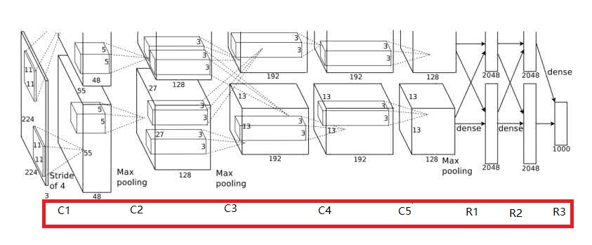


## VGG

* 全部是`kernel=3*3，padding=1`的小卷积核，卷积操作不改变feature map的分辨率
* 加深网络
* 可以将网络表示为`[[Conv2d+ReLU]*m+MaxPool2d]*n + Linear`
* 如果增加bn层，将`[Conv2d+ReLU]`修改为`[Conv2d+BatchNorm2d+ReLU]`

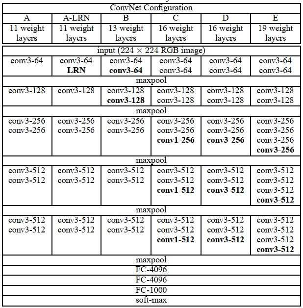


## GoogLeNet V1

v1: Going deeper with convolutions
* 借鉴多尺度Gabor滤波器，增加网络深度的同时，增加网络宽度，引入Inception模块
* 借鉴NIN结构，引入1*1卷积

Inception模块

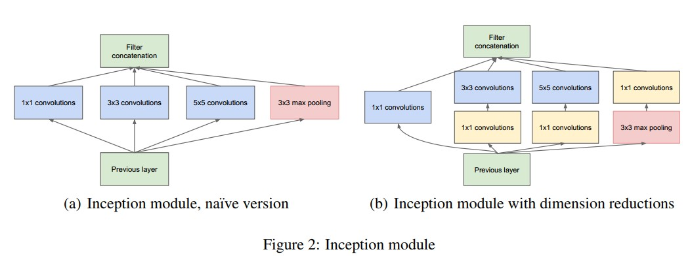

GoogLeNet架构

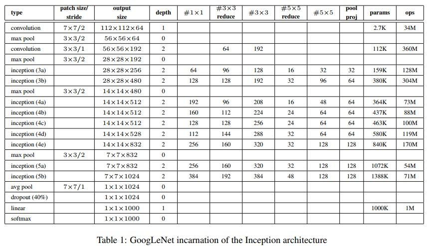

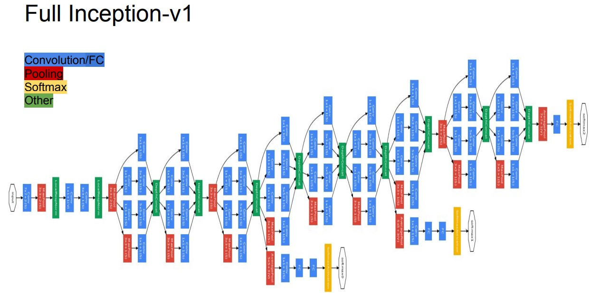

## GoogLeNet V2

v2: Batch Normalization: Accelerating Deep Network Training by Reducing Internal Covariate Shift
* 提出BN层用于解决数据偏移的问题（内部协变量偏移ICS），加速网络收敛
* 开启标准化层用于神经网络的时代
  * 在Batch Normalization基础上拓展出了一系列标准化网络层，如Layer Normalization（LN），Instance Normalization（IN），Group Normalization（GN）
* 相对v1的改变：
  * 卷积层和激活层之间增加BN层
  * 将 5\*5 卷积更改为两个 3\*3 卷积

BatchNorm计算过程

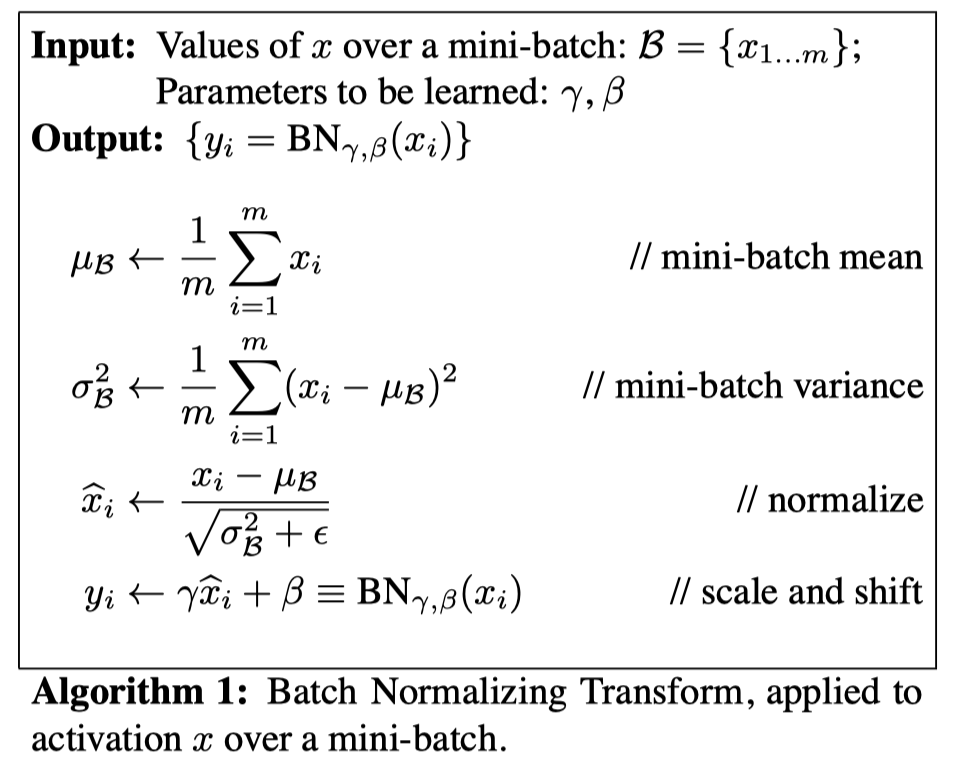

反向传播计算公式

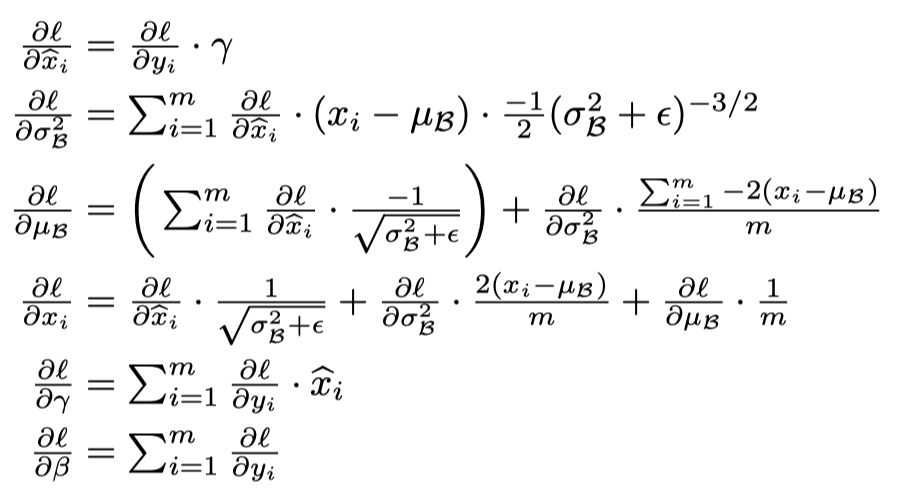

BN训练过程

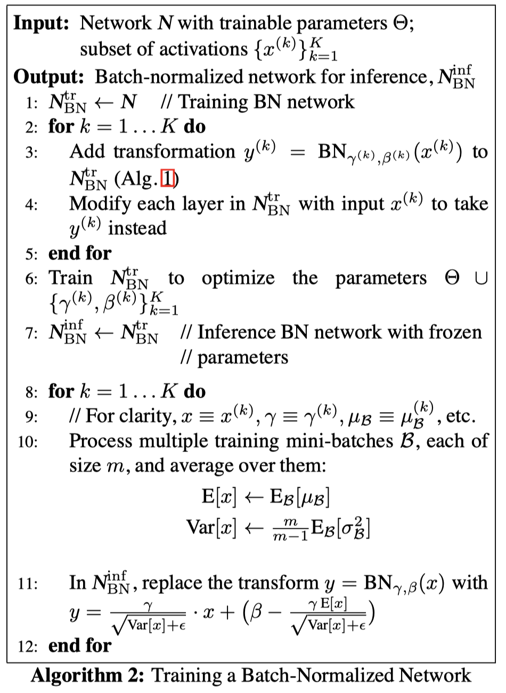

注意：
* bn层中每个channel一个均值一个方差，channel的均值和方差的调整过程遵循动量的原则。
* 可查看代码 [BatchNorm_test](./BatchNorm_test.py)

`mean_new = momentum * mean_batch + (1 - momentum) * mean_old`

`var_new = momentum * var_batch + (1 - momentum) * var_old`

* 推理阶段，采用训练阶段的最后一个batch之后的mean和var，推理阶段的mean和var不改变。

BN推荐参考资料[莫烦ptyhon:什么是批标准化](https://mofanpy.com/tutorials/machine-learning/tensorflow/intro-batch-normalization/)

## GoogLeNet V3

v3: Rethinking the Inception Architecture for Computer Vision
* 论文中提出3中不同的inception模块，代码中有5种
* 只要一个辅助损失层，在17*17结束之后
* 采用了标签平滑

三种不同的inception结构如下：

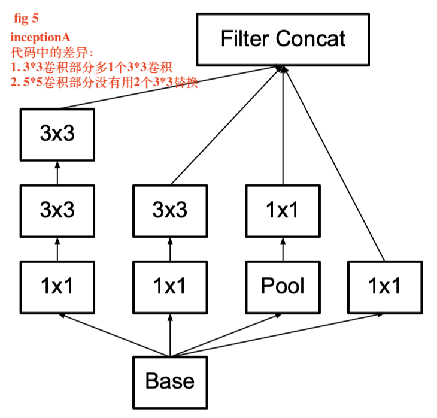
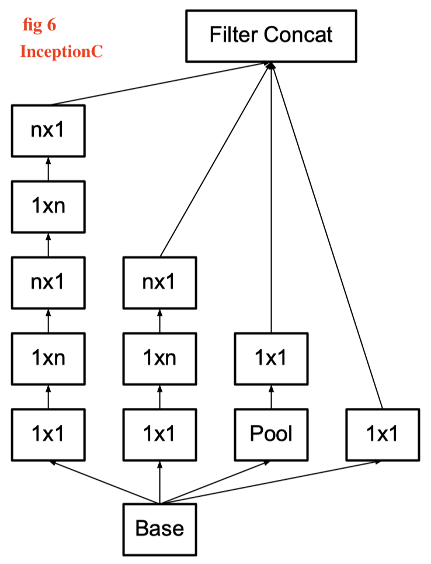
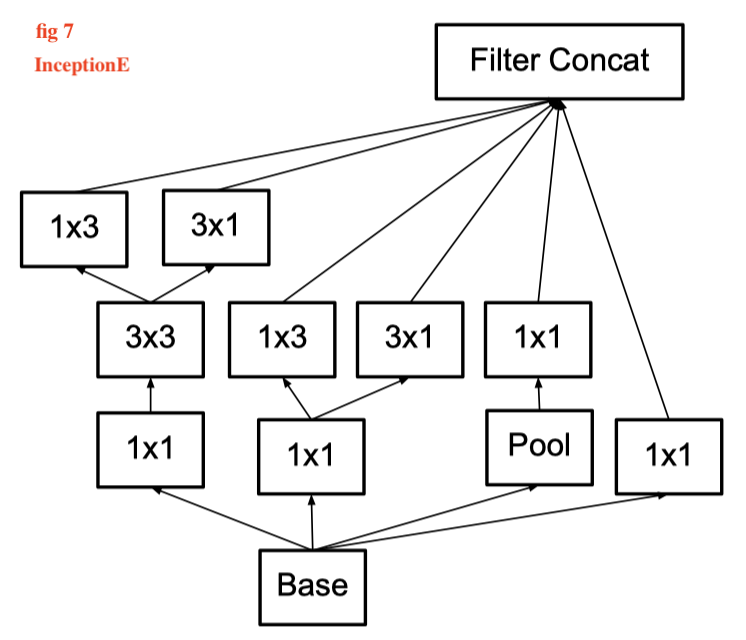
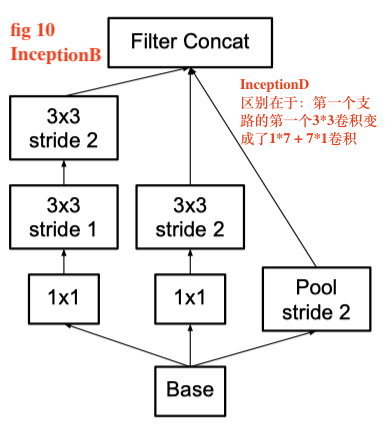

Inception V2模型架构如下：

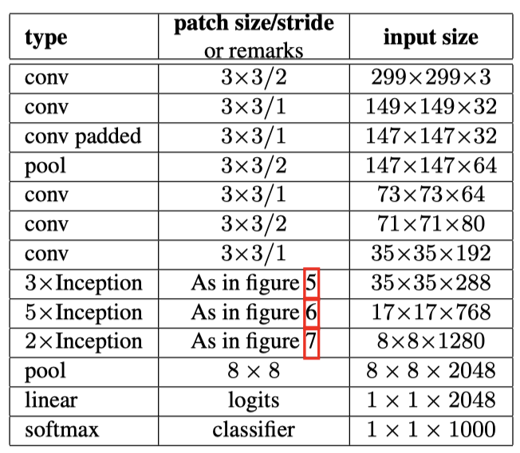

Inception V3版本相比V2版本修改的地方有：

1. 采用RMSProp优化方法
2. 采用Label Smoothing正则化方法
3. 采用非对称卷积提取17*17特征图
4. 采用带BN的辅助分类层

标签平滑的公式如下：

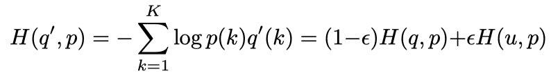

注意，其中交叉熵损失中用p的分布逼近q的分布，公式中的u指均匀分布。

标签平滑的代码在torchvision中没有，不能采用CrossEntropy及其变形，需要重新写这段代码。

```python
class LabelSmoothingCrossEntropy(nn.Module):
    """
    Label Smoothing Cross Entropy Loss
    """
    def __init__(self, eps=0.001):
        super(LabelSmoothingCrossEntropy, self).__init__()
        self.eps = eps

    def forward(self, x, target):
        # CE(q, p) = - sigma(q_i * log(p_i))
        log_probs = torch.nn.functional.log_softmax(x, dim=-1)  # 实现  log(p_i)

        # H(q, p)
        H_pq = -log_probs.gather(dim=-1, index=target.unsqueeze(1))  # 只需要q_i == 1的地方， 此时已经得到CE
        H_pq = H_pq.squeeze(1)

        # H(u, p)
        H_uq = -log_probs.mean()  # 由于u是均匀分布，等价于求均值

        loss = (1 - self.eps) * H_pq + self.eps * H_uq
        return loss.mean()
```

## ResNet

主要思想：让网络去拟合H(x)-x，而不是H(x)

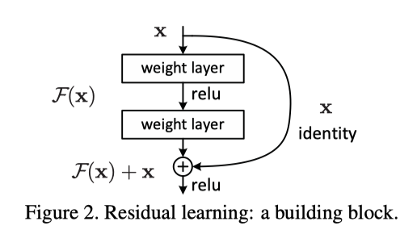

这种结构的好处在于：

1. 更容易拟合恒等映射，让深度网络不至于比浅层网络差。
2. 解决深度网络的网络退化问题。
   1. 深度网络的表达能力更强，如果是过拟合，则训练误差应该更小
   2. 但实际上训练误差并非更小，所以深层网络的效果差并非过拟合的问题，而是难以优化的问题

在CIFAR10上的实验证明了网络退化的问题。

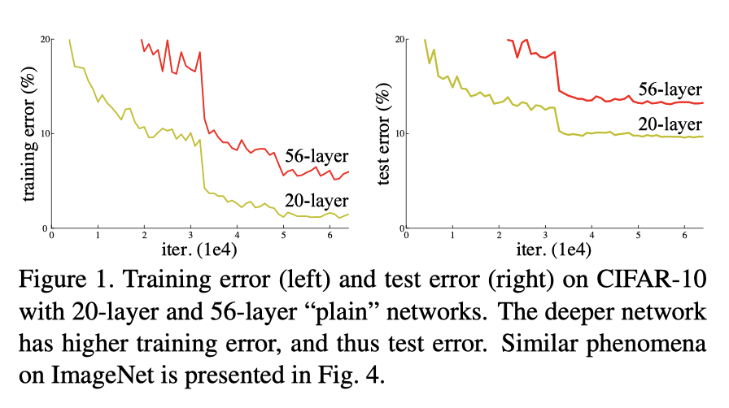

ResNet的网络结构如下，特点可总结为：开头通过两个stride2迅速降低分辨率，然后再用4阶段残差结构堆叠，池化+FC输出。

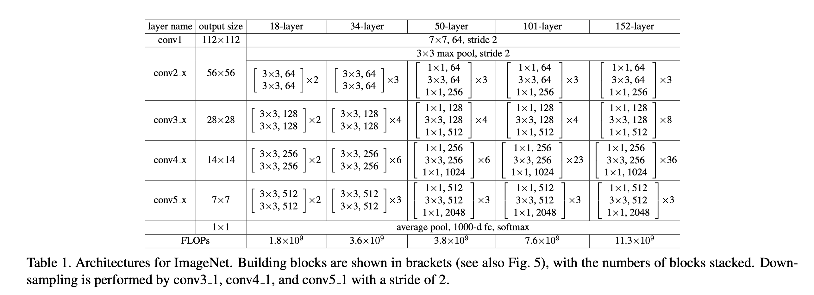

## GoogLeNet V4

提出问题:能否将Inception和ResNet结构结合，提高神经网络性能？

提出两个模型架构，分别是Inception-V4和Inception-ResNet-V1/V2.

Inception-V4包括六大模块，分别是Stem、Inception-A/B/C、Reduction-A/B，每个模块都有针对性的设计，共76层。

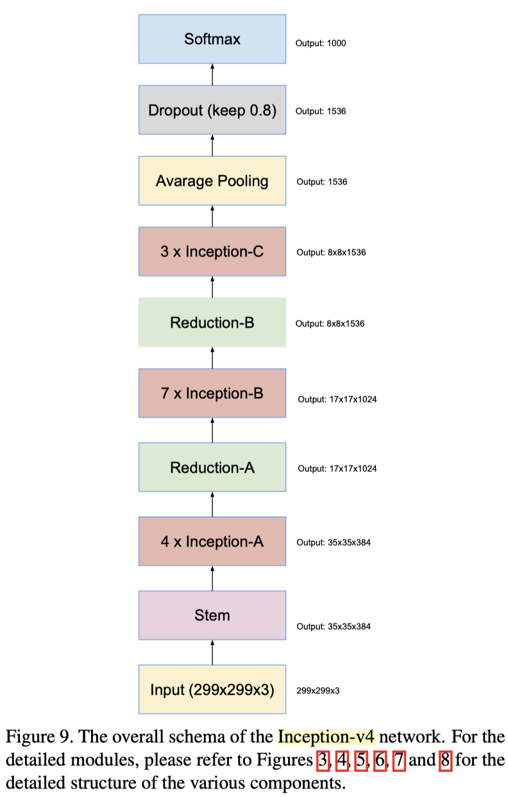

Inception-ResNet是将residual的思想加入到Inception模块当中，模块一样，但是模块内部的差异不同，需看论文中的图进一步了解。

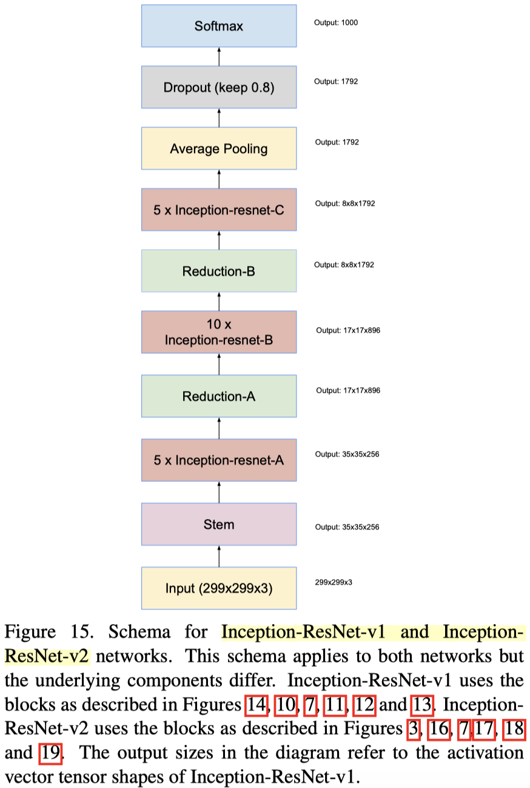

## ResNetXt

借鉴VGG和resnet使用相同块叠加和inception模型的拆分-变换-合并的思路，设计了一种简明的结构，及其两种等价形式。其中，形式B很像Inception-ResNet网络中的模块，不同的是每个分支都具有相同的拓扑结构；形式C与AlexNet中分组卷积（grouped convolutions）的理念相似，然而AlexNet使用分组卷积是受限于当时的硬件条件

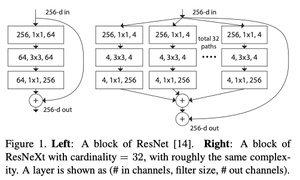

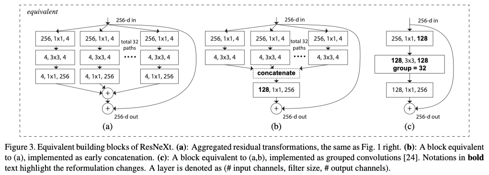

论文总结出一套模块化的设计理念（可减小超参数的数量），网络由一系列block堆叠而成，并遵循两个简单的原则
* 如果block输出的特征图的空间尺寸相同，那么他们有相同的超参数（宽度、滤波器尺寸等）
* 如果特征图的空间维度减半，那么block的宽度（通道数）加倍，第二条规则确保了所有block的计算复杂度基本相同

按照这种规则设计的ResNet-50和ResNeXt-50如下图所示：

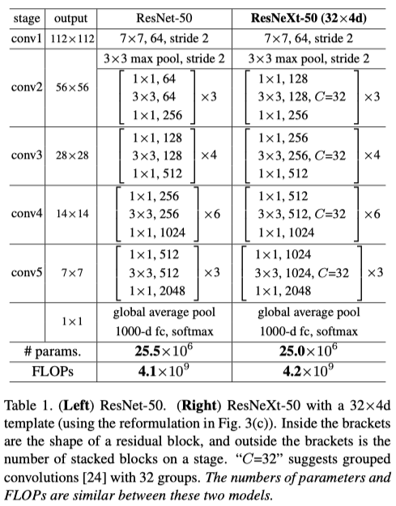

提出聚合变换，并指出内积是最简单的聚合变换的形式，可分为拆分（splitting）、变换（transforming）、聚合（aggregating）。

本文最重要的贡献是用聚合变化的思路将resnet和inception的优点结合，得到分组卷积。

torchvision代码中的模型包括50_32\*4d和101_32\*8d这两种形式。

## DenseNet

本文在ResNet的基础上，沿用VGG的简洁结构设计，同时堆叠的building block采用残差结构，在前人对于short path的研究基础上提出了新的角度（即特征复用和信息流通不畅的角度），并且指出了特征复用可以提高模型的表达能力。

网络采用dense block和下采样层组成，因为稠密连接不能连接不同大小的feature map。

dense block包括三个部分，BN-ReLU-Conv，其结构如下：

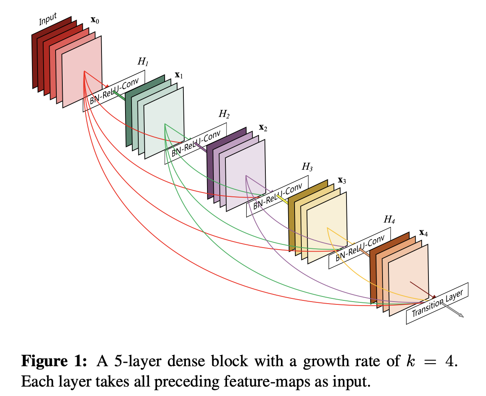

拥有三个dense block的denseNet的结构如下：

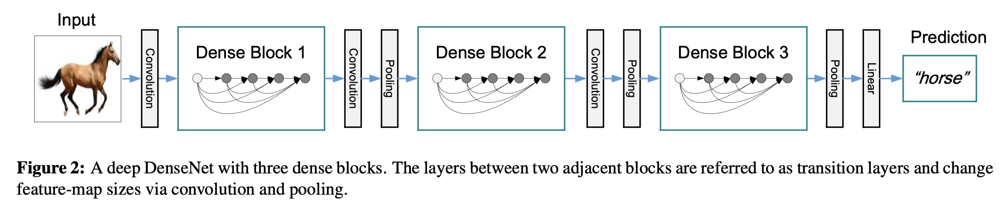

用于Imagenet的网络包含4个dense block的DenseNet-BC结构，输入尺寸为224*224，结构如下：


DenseNet-B表示基于bottlenet的dense block，结构为 `BN-ReLU-Conv(1*1)-BN-ReLU-Conv(3*3)`

网络还设计了其他的超参数来限制网络的自由度
* 增长速率k：每个组合函数产生k个特征图，那么，之后的第i层就有k0+k*(i-1)个特征图作为输入
* 压缩系数θ：表示在bottleNet结构中，先用`1*1`卷积从`m`降低通道数目为`θ*m`

DenseNet的一个重要缺点是**显存占用大**，参考[深度学习中的GPU和显存分析](https://zhuanlan.zhihu.com/p/31558973)，深度学习中显存占用量较大的包括：
* 模型自身的参数
* 模型的输出

如果是在训练阶段，根据优化函数的不同，模型参数要保存的梯度的量也有区别。
* 不带动量的SGD，只需要保存梯度即可，占用显存=参数的显存
* 带动量的SGD，需要保存参数的梯度和梯度的动量（即上一时刻的梯度），占用显存=2*参数的显存
* Adam优化器，占用显存=2*参数的显存

在训练阶段，也要保存模型的输出的梯度，输出的梯度不需要计算动量。

在DenseNet中，模型输出的梯度占用的显存最大，是问题的核心所在。

## SENet

较早的将注意力机制引入卷积神经网络，并且该机制是一种即插即用模块，可嵌入到任意主流的卷积神经网络中，为卷积神经网络模型设计提供了新思路——即插即用模块设计。

卷积神经网络的核心是卷积操作，其通过局部感受野的方式融合空间和通道维度的特征；针对空间维度的特征提取方式已被广泛研究；本文针对通道维度进行研究，探索通道之间的关系。

SE block的结构如下，包括squeeze操作、excitation操作和一个scale操作
* squeeze操作具体是全局池化;文中通过消融研究，最后选择了全局平均池化
* excitation操作具体是两个全连接层：linear-relu-linear-sigmoid
* scale即为一个乘法操作

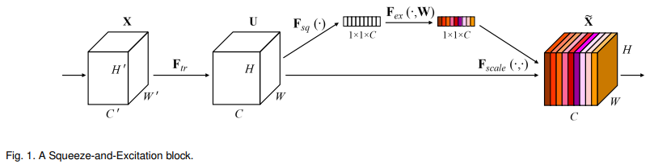

作为即插即用模块，SE block和Inception或者ResNet结合的示意图如下：


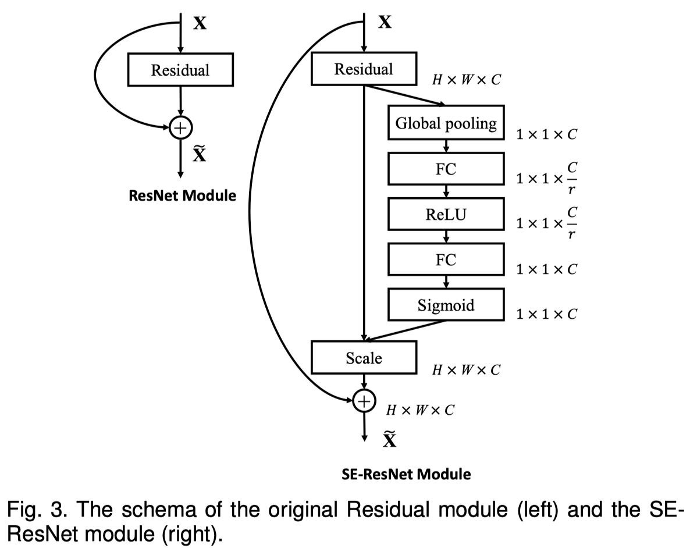

加入SE block的ResNet-50以及ResNeXt-50的结构如下图所示：

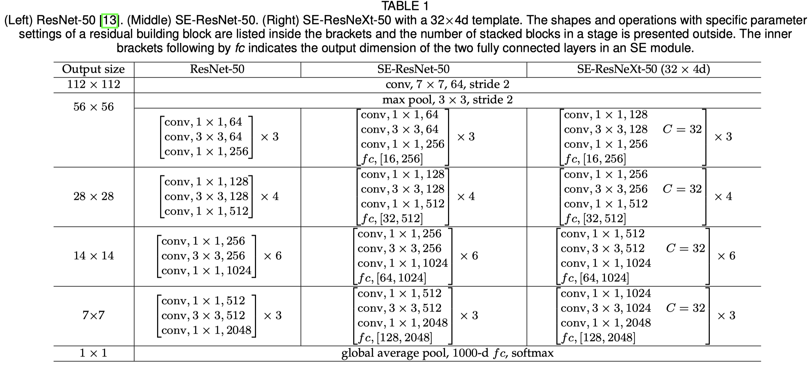

其次，值得关注的点是文章中详细的消融研究的实验，即控制变量法来对比不同的设置的表现。

最后，用实例来验证了SE block的作用，从ImageNet数据集中抽取了四个类，这些类表现出语义和外观多样性，即金鱼，哈巴狗，刨和悬崖；然后从验证集中为每个类抽取50个样本，并计算每个阶段最后的SE块中50个均匀采样通道的平均激活（紧接在下采样之前），并在图7中绘制它们的分布

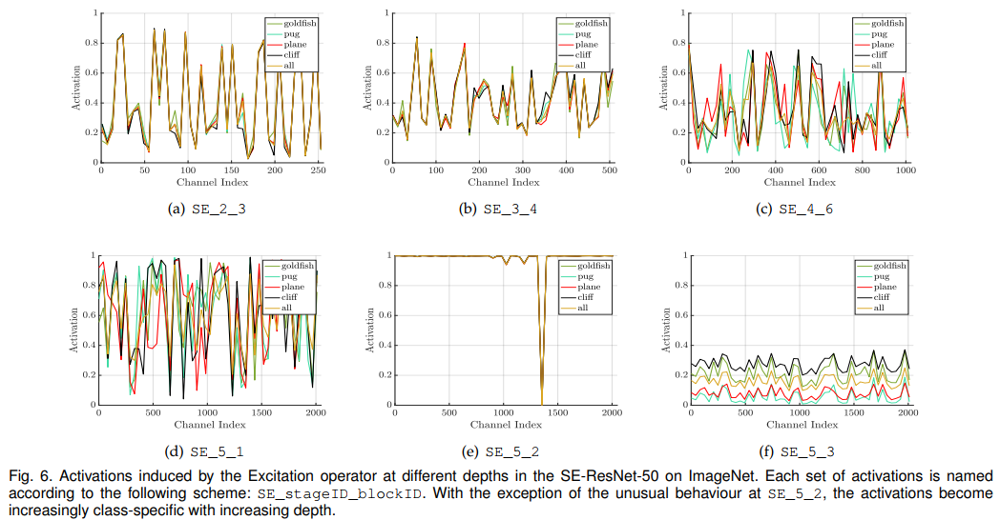

输出值越动荡，说明SE对channel具有选择作用，从图中可以看出：前三个stage的方差较大，最后一个stage的后两个block的方差较小，因此可以不加SE block，以节省参数。