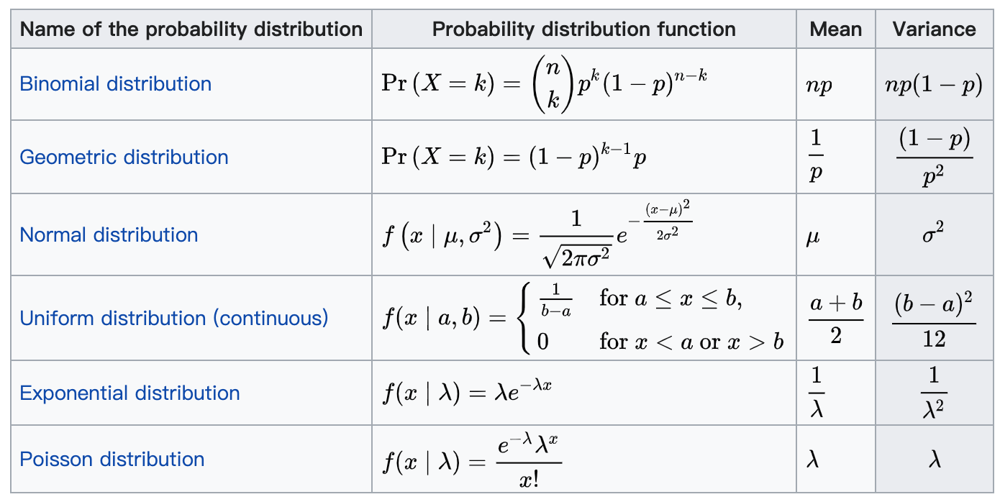

# initialization

> 现代的初始化策略是简单的、启发式的。设定改进的初始化策略是一项困难的 任务，因为神经网络优化至今还未被很好地理解。大多数初始化策略基于在神经网 络初始化时实现一些很好的性质。然而，我们并没有很好地理解这些性质中的哪些会 在学习开始进行后的哪些情况下得以保持。进一步的难点是，有些初始点从优化的 观点看或许是有利的，但是从泛化的观点看是不利的。我们对于初始点如何影响泛 化的理解是相当原始的，几乎没有提供如何选择初始点的任何指导。——《花书》

## Expected_value

* https://en.wikipedia.org/wiki/Expected_value

If X and Y are independent, $E[XY] = E[X]*E[Y]$ \
If X and Y are dependent,$E[XY] \neq E[X]*E[Y]$

* https://en.wikipedia.org/wiki/Variance#Product_of_independent_variables

If X and Y are independent, 

$$
Var(X Y)=E[X]^2 * Var(Y)+E[Y]^{2} * Var(X) + Var(X) * Var(Y)
$$

$$
Var(X Y)=E[X]^2 * E[Y]^2 - (E[X] * E[Y])^2
$$

## Xavier

Xavier初始化的基本思想是，若对于一层网络的输出和输出可以保持正态分布且方差相近，这样就可以避免输出趋向于0，从而避免梯度弥散情况。

考虑$Y=WX$，因为 $E(W)=E(X)=0$, $Var(Y) = n_{in} * Var(W) * Var(X)$，反向传播时，为$n_{out}$，两次取平均，令$Var(Y)=Var(X)$，所以有$\frac{n_{in}+n_{out}}{2} * Var(W) = 1$

所以，如果W是均匀分布，则服从$U~(-a,a), a=\sqrt{\frac{6}{n_{in}+n_{out}}}$

## He init

He初始化基本思想是，当使用ReLU做为激活函数时，Xavier的效果不好，原因在于，当RelU的输入小于0时，其输出为0，相当于该神经元被关闭了，影响了输出的分布模式。

因此He初始化，在Xavier的基础上，假设每层网络有一半的神经元被关闭，于是其分布的方差也会变小。经过验证发现当对初始化值缩小一半时效果最好，故He初始化可以认为是Xavier初始/2的结果。
