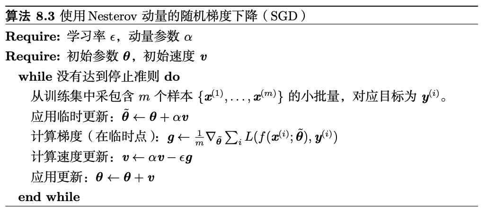
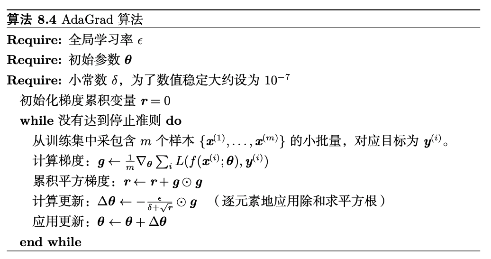
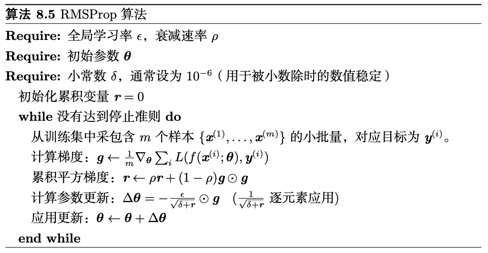
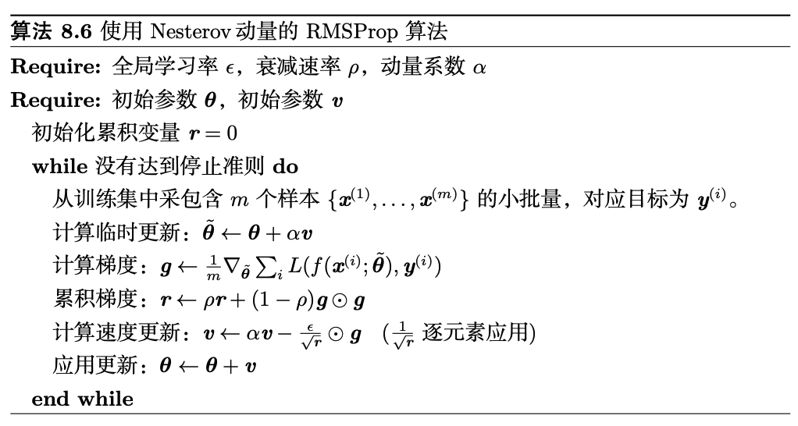
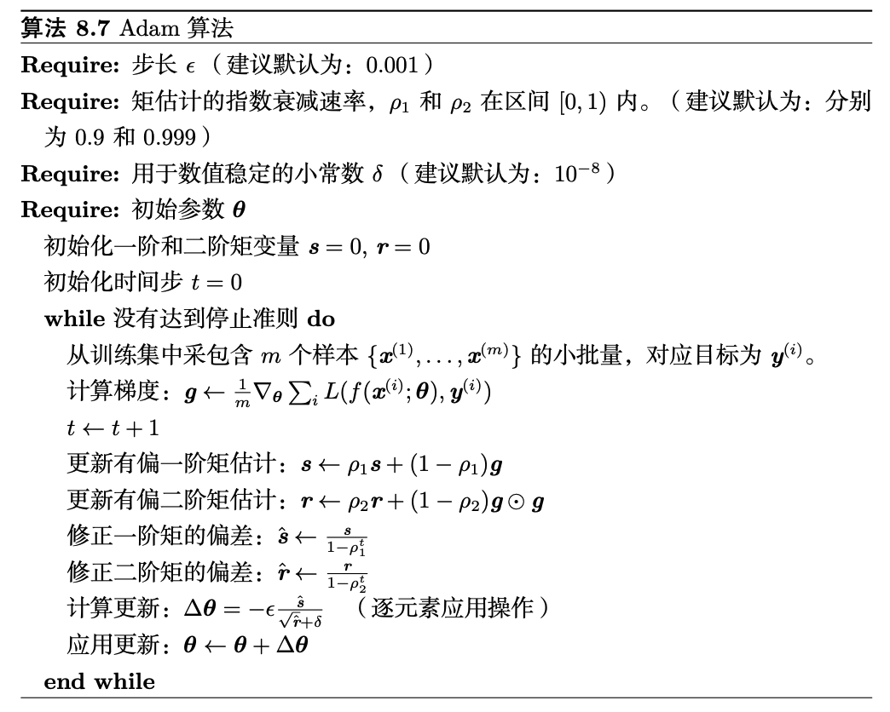

# optimizer

## SGD with Momentum

$p, g, v$ and $\mu$ denote the parameters, gradient, velocity, and momentum respectively.

* Nesterov version [pytorch]

$$v_{t+1}=u * v_{t}+g_{t+1}$$
$$p_{t+1}=p_{t}-lr * v_{t+1}$$

* Sutskever version [others]

$$v_{t+1}=u * v_{t}+lr*g_{t+1}$$
$$p_{t+1}=p_{t}-v_{t+1}$$

## AdaGrad (Adaptive Gradient)

Adagrad 是一种自适应优化方法，是自适 应的为各个参数分配不同的学习率。这个学习率的变化，会受到梯度的大小和迭代次数的 影响。梯度越大，学习率越小;梯度越小，学习率越大。缺点是训练后期，学习率过小， 因为 Adagrad 累加之前所有的梯度平方作为分母。

## RMSProp (root mean square prop)

RMSProp 使用指数衰减平均以丢弃遥远 过去的历史，使其能够在找到凸碗状结构后快速收敛，它就像一个初始化于该碗状 结构的 AdaGrad 算法实例。
RMSprop是对 Adagrad 的一种改进， 采用均方根作为分母，可缓解 Adagrad 学习率下降较快的问题。

## Adam (Adaptive Moment Estimation)

Adam 是一种自适应学习率的优化方法，Adam 利用梯度的一阶矩()估计和二阶矩()估计动态的调整学习率，结合了 Momentum 和 RMSprop，并进行了偏差修正。

