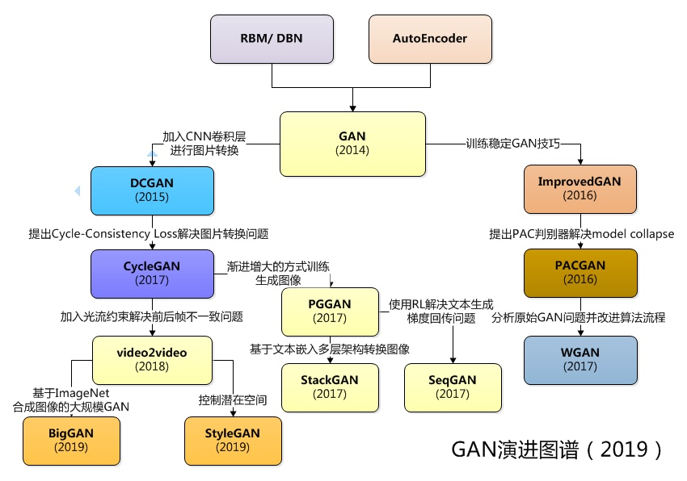

# CV GAN

| model | conference | paper | first author | institute |
| - | - | - | - | - |
| GAN | NIPS 2014 | Generative Adversarial Nets | Ian J. Goodfellow | Universite de Montreal |
| CGAN | arxiv 2014 | Conditional Generative Adversarial Nets | Mehdi Mirza | Universite de Montreal |
| DCGAN | ICLR 2016 | Unsupervised Representation Learning with Deep Convolutional Generative Adversarial Networks | Alec Radford & Luke Metz | indico Research, Boston, MA |
| ITGAN | NIPS 2016 | Improved Techniques for Training GANs | Tim Salimans | openai |
| pix2pix | CVPR 2017 | Image-to-Image Translation with Conditional Adversarial Networks | Phillip Isola | Berkeley AI Research (BAIR) Laboratory |
| CycleGAN | CVPR 2017 | Unpaired Image-to-Image Translation using Cycle-Consistent Adversarial Networks | Jun-Yan Zhu & Jun-Yan Zhu | Berkeley AI Research (BAIR) Laboratory |
| ProGAN | ICLR 2018 | Progressive Growing of GANs for Improved Quality, Stability, and Variation | Tero Karras | NVIDIA |
| StackGAN | ICCV 2017 | StackGAN: Text to Photo-realistic Image Synthesis with Stacked Generative Adversarial Networks | Han Zhang | Rutgers University |
| BigGAN | ICLR 2019 | Large Scale GAN Training for High Fidelity Natural Image Synthesis | Andrew Brock & Jeff Donahue | Jeff Donahue & DeepMind |
| StyleGAN | CVPR 2019 | A Style-Based Generator Architecture for Generative Adversarial Networks | Tero Karras | NVIDIA |

GAN演进图谱
