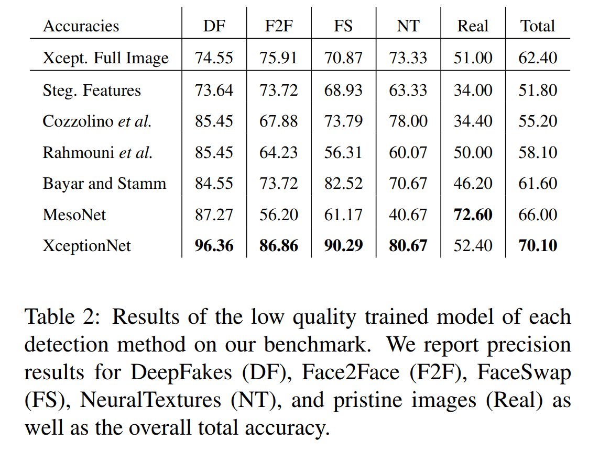
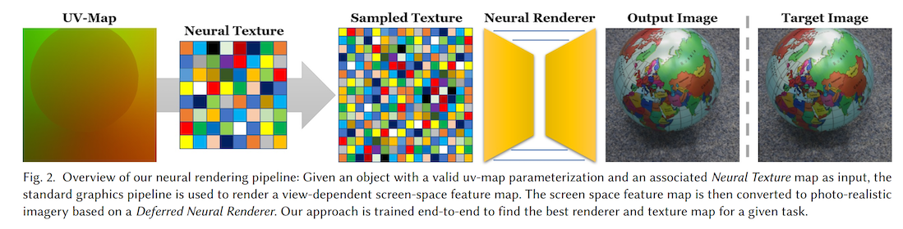
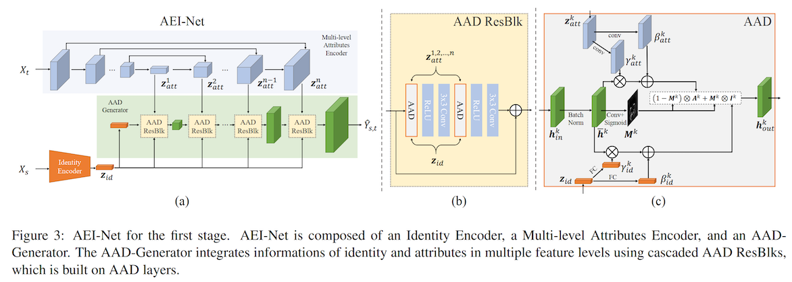
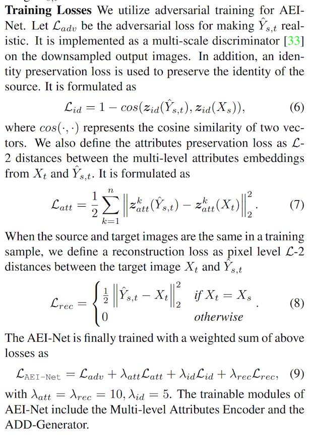
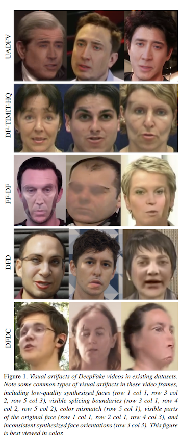
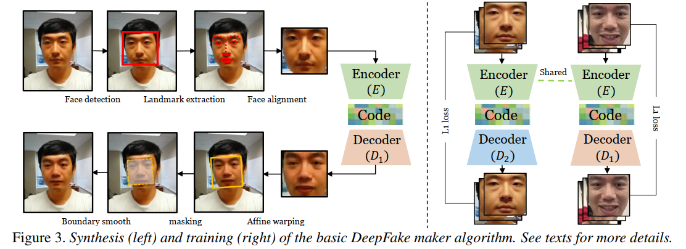
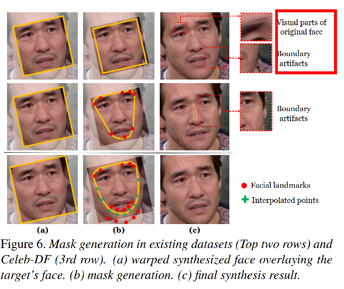
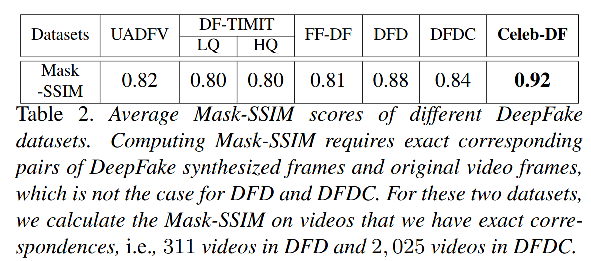
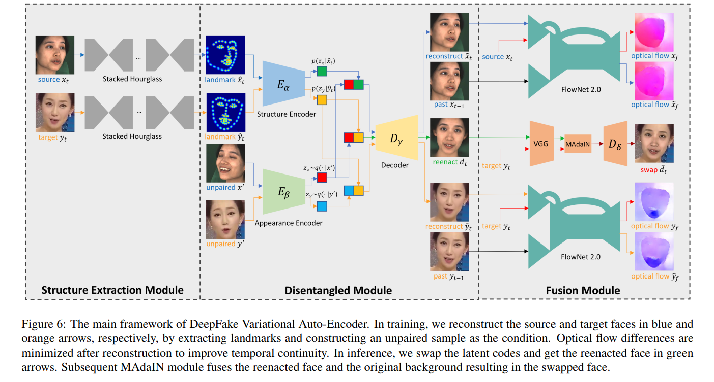

# 数据集

| dataset | publish date | conference | author |
| - | - | - | - |
| [FF++(FaceForensics++)](https://github.com/ondyari/FaceForensics) | 25 Jan 2019 | iccv19 | Andreas R¨ossler(Technical University of Munich) | 
| [Celeb-DF](http://www.cs.albany.edu/~lsw/celeb-deepfakeforensics.html) | 27 Sep 2019 | cpvr20 | Yuezun Li(University at Albany) |
| [DeeperForensics-1.0](https://github.com/EndlessSora/DeeperForensics-1.0) | 9 Jan 2020 | cvpr20 | Liming Jiang(NTU Singapore), wuwenyan(sensetime) |
| [DFDC](https://ai.facebook.com/datasets/dfdc) | 12 Jun 2020 |  | Brian Dolhansky(Facebook AI) |

## FF++

文章贡献：提出数据集，提供二分类方法的基准。

[FaceForensics](http://niessnerlab.org/projects/roessler2018faceforensics.html)数据集最早发表于18年3月，这个数据集使用Face2Face方法来制作假视频。

FaceForensics++最早发表于19年1月，是FaceForensics数据集的扩展，对数据集只包含1000个youtube的原视频（部分从youtube-8m获取，部分通过youtube检索得到）和四种类型的假视频各1000个（官方提供了划分train/val/test）的方法，需要注意的是，这里的假视频是两两作为一对，然后分别作为source和target，1000个原视频共有500对(360/70/70)，分别作为target和source，即可得到1000个假视频。该文章19年5月投稿ICCV2019，后被接收。

共1000个视频，分成500对，按照360、70、70的比例划分train/test/val。
因为是两两交换，所以伪造视频也是1000个。

19年9月增加了由google AI lab提出的[DeepFakeDetection](https://ai.googleblog.com/2019/09/contributing-data-to-deepfake-detection.html)数据。

FaceShifter是北大和MSRA研究的一种两阶段的换脸方法，最早发表于19年12月，20年5月加入FF++数据集，该文章被CVPR 2020接收。

```
root-dir:
    manipulated_sequences:
        DeepFakeDetection
            raw/c23/c40 # 每种方式3068个假视频
                <target actor>_<source actor>__<sequence name>__<8 charactor long experiment id>.mp4
                raw/0: ~200GB
                23: ~3GB
                40: ~400MB
            mask: # 和videos相对应，这里的mask和之前的四种不太一样，展示的是2d换脸区域
        Deepfakes|Face2Face|FaceSwap|NeuralTextures
            raw/c23/c40 # 1000个视频，一对之间相互交换，四种变换均相同
                <target sequence>_<source sequence>.mp4 # source 提供人脸，target提供背景
                raw/0: ~1.6TB
                c23: ~22GB
                c40: ~3GB
            mask: # 和videos相对应
        FaceShifter
            换脸方式和上面提到的四种一样，1000个视频两两成对
    original_sequences:
        actors/c23/videos # 16个不同场景中28位付费演员的363个原始序列
            <actor number>__<scene name>.mp4
        youtube # 都是1000个视频，分辨率不同
            < c0/raw original sequence images/videos of the FaceForensics++ dataset > 
                ~500GB
            < c23/hq original sequence images/videos >
                ~10GB
            < c40/lq original sequence images/videos >
                ~2GB
```

评测网站：[benchmark results for the Binary Classification](http://kaldir.vc.in.tum.de/faceforensics_benchmark/)
下载benchmark图片，然后按格式提交对每张图片的预测，即可得到结果。

该数据集采用h.264编码器对视频进行压缩，c23为高质量压缩，视觉上几乎无损，c40为低质量压缩。

另外，该数据集在4.1节进行了user study，对视频中的图片进行真假判断，并且设置不同的时间（即每张图片看多长时间），

可以观察到FF++数据集的问题：
* DF、F2F、FS、DFD、FaceShifter四种方式都有明显的帧间闪烁，人眼可分辨
* NT由于只换嘴型，帧间闪烁不明显

FF++中在低分辨率视频上的二分类测试结果如下benchmark


### 技术路线

| forensics type | publish | author | tutorial | description | 
|----------------|--------------|--------| -------- | ----- |
| [Deepfakes](https://github.com/deepfakes/faceswap)      | first commit: Dec 15, 2017    |        |         | 换脸，learning-based，提供开源python代码 |
| [Faceswap](https://github.com/MarekKowalski/FaceSwap)    | first commit: Jun 19, 2016   | MarekKowalski |        | 换脸，computer graphics-based |
| [Face2Face](https://openaccess.thecvf.com/content_cvpr_2016/html/Thies_Face2Face_Real-Time_Face_CVPR_2016_paper.html)  |  cvpr16     | Justus Thies(University of Erlangen-Nuremberg)  |         | 换表情，computer graphics-based |
| [NeuralTextures](https://arxiv.org/abs/1904.12356) | ACM Graphics on Transactions(28 Apr 2019)    | Justus Thies(Technical University of Munich)       |        | 换脸，learning-based |
| [FaceShifter](https://lingzhili.com/FaceShifterPage/) | CVPR 2020(	 15 Nov 2019)  | Lingzhi Li(Peking University & Microsoft Research)   |        | ？ |

#### deepfakes

* [github](https://github.com/deepfakes/faceswap/)
* 精简的代码[joshua-wu/deepfakes_faceswap](https://github.com/joshua-wu/deepfakes_faceswap)，这里可以很清楚的看到网络结构
* **精简的pytorch版本[Oldpan/Faceswap-Deepfake-Pytorch](https://github.com/Oldpan/Faceswap-Deepfake-Pytorch)**

1. 步骤1：Extracting Faces。可以从图片或者视频中检测并提取人脸框和关键点
2. 步骤2：训练自编码器
   * 输入预处理
       * 初试大小为(3,256,256)
       * 除以255归一化
       * 分别计算tar的rgb均值，然后将其加到scr上
       * 随机旋转+-10
       * warpAffine，边缘填充方式为BORDER_REPLICATE
       * 最后再经过一些变化为(3,64,64)后输入网络
   * 模型结构
       * 这里解码器采用的_UpScale操作比较特别，是先用conv2d和LeakyReLU，之后再经过pixelshuffler
       * 所谓pixelshuffler，其实就是对输出的shape进行重新定义，将其h,w加倍，c变成原来的四分之一
   * loss & optimizer
       * L1Loss
       * Adam
3. 步骤3：生成换脸视频
   * 生成一个方形mask，然后将脸贴上去

#### faceswap

1. 步骤1：预处理
   1. 初始化dlib的68关键点检测模型
   2. 调用保存的3D人脸模型，来自于[CANDIDE](http://www.icg.isy.liu.se/candide/)
2. 步骤2：对于每一帧的处理
   1. 用dlib获取人脸框
   2. 用dlib检测人脸关键点
   3. 将3D人脸寻找最优角度投影到关键点上
   4. 使用羽化（alpha混合）、色彩校正将渲染模型的图像与原图像混合

#### Face2Face

这是cvpr16的文章，采用基于图形学的方法，不换脸，而是将src的表情转移到tar上。

#### Neural Textures

本文将自编码器用到了传统的图形管线当中，替代其中的一个步骤，相比传统的图像管线，生成更具有真实性，相比神经网络，更具有可解释性。




#### FaceShifter

本文有三个贡献：
* 提出了一种新颖的多级属性编码器，用于以各种空间分辨率提取目标属性，而不是像RSGAN [29]和IPGAN [5]那样将其压缩为单个矢量
* 引入面部区域分割来识别遮挡的mask
* 不需要针对专门的人重新训练，一次训练，多次换脸



第一阶段：Adaptive Embedding Integration Network，包括三个部分
* Identity encoder：采用pretrained face reognition model（Arcface）。有理由相信经过大规模2D人脸训练的识别模型可以提供一个representative identity embeddings
* Multi-level Attributes Encoder： Face attributes, such as pose, expression, lighting and background, require more spatial informations than identity. In order to preserve such details, we propose to represent the attributes embedding as multi-level feature maps, instead of compressing it into a single vector as previous methods [5, 29]. 人脸特性比较复杂，用多个特征表示，而不是最终一个特征。人脸属性不需要标注信息，这是自监督的（因为需要产生的Yst和Xt的属性相同）
* Adaptive Attentional Denormalization Generator: 将前两块生成的Zid和Zatt输入该网络生成Yst。AAD中，hk分为3个分支，分别表示属性、身份、自注意力蒙版。

自监督框架，不需要标注数据，损失函数如下图（包括对抗损失，id损失，属性损失，重建损失）：




## Celeb-DF

```
root-dir:
    YouTube-real:
        00000.mp4~00299.mp4 # 共300个视频，额外的youtube下载真视频
    Celeb-real:
        id*.mp4 # youtube收集的590个原始视频，59个名人，每人十段视频，来源于youtube上公开获取的59个名人的视频片段。
    Celeb-synthesis:
        *.mp4 # Celeb-real中的对应的5639个假视频
    List_of_testing_videos.txt # 518个视频路径
```

论文贡献：比之前的数据集质量都高，并且提供了最全面的检测方法评估。

动机：之前的数据集质量较差，在图1中突出显示，包括低质量的合成脸部，可见的拼接边界，颜色不匹配，原始脸部的可见部分以及合成的脸部方向不一致。



### 技术路线

使用改进的DeepFake合成方法生成的，59个名人，590个视频，相互交换人脸生成假视频。

原始的DeepFake技术路线如下图所示：


共享的encoder主要用于编码与个体无关的表情等人脸属性，不共享的decoder用于解码各自的信息。

改进方法有以下四点：
* 提高分辨率：将合成人脸的分辨率提高到256*256，通过使用具有更多层和更大尺寸的编码器和解码器模型来实现，分辨率较高的话不仅视觉效果好，而且适应输入人脸时，调整大小和旋转操作的影响较小。
* 颜色失配：通过训练数据增强和后期处理，可以显着减少Celeb-DF中合成供体的脸部与原始目标的脸部之间的颜色失配。训练时将输入人脸增加随即颜色扰动，迫使网络学习相同颜色空间的人脸。后处理采用颜色转移算法。[Color transfer between images](https://ieeexplore.ieee.org/document/946629)
* 不正确的面罩：之前的数据集中的面罩要么是矩形的，要么是convex hull of landmarks on eyebrew and lower lip，这样让边界有时候看起来很明显。改进面罩的生成过程，其实就是让关键点范围更大，然后用差值的方法让面罩变得更大。如下图所示。
* **合成视频的帧间闪烁：用卡尔曼滤波对人脸特征点进行平滑，减少不同帧检测的关键点的误差。**



另外，文中3.3节对视频质量进行评估，这之前，没有广泛使用的标准。文中采用face in-painting任务中的评估标准Mask-SSIM分数作为参考定量指标，Mask-SSIM指的是在头部区域(including face and hair)的SSIM分数( SSIM由亮度对比、对比度对比、结构对比三部分组成，用于比较两张图片的相似性)。

低分数的SSIM可能有两个原因，包括identity change和inferior visual quality。这里只比较视频中的帧，所以在deepfakes数据集中，identity change所带来的误差是基本类似的，所以比较SSIM的绝对值是没有意义的，但是一个视频中的SSIM的值的变化反映了visual quality.

这里没有用user study进行评估。

【疑问？】这个表格的数值的绝对数值吗？没有写清楚这个数值是怎么计算的



## DeeperForensics-1.0

[github](https://github.com/EndlessSora/DeeperForensics-1.0)

[DeeperForensics Challenge 2020 @ ECCV SenseHuman Workshop](https://competitions.codalab.org/competitions/25228)

```
DeeperForensics-1.0
|--lists
   |--manipulated_videos_distortions_meta
      <several meta files of distortion information in the manipulated videos>
   |--manipulated_videos_lists
      <several lists of the manipulated videos>
   |--source_videos_lists
      <several lists of the source videos>
   |--splits
      <train, val, test data splits for your reference>
|--manipulated_videos
   <11 folders named by the type of variants for the manipulated videos>
|--source_videos
   <100 folders named by the ID of the actors for the source videos, and their subfolders named by the source video information>
|--terms_of_use.pdf
```

动机：
* 之前的数据集（FaceForensics++, Deep Fake Detection and DFDC）的缺点：Videos in these datasets are either of a small number, of low quality, or overly artificial
* 我们相信，只有在使用足够详尽的数据集进行训练以涵盖尽可能多的潜在现实变化时，才能增强伪造检测模型
* 源数据是影响视频质量的重要因素，互联网视频的缺点在于有限的姿态变化等。文章发现，构建数据集时，源脸比目标脸更重要，也就是说，源脸的表情、姿态和照明条件应更丰富。

* Deep Fake Detection: google 请了28个演员，真假视频共3431个
* DFDC preview dataset: 请了66个演员，5214 original and tampered videos with three types of augmentations

50,000个真视频，10,000个假视频。

构建该数据集时，我们提出了三个标准：
1. 质量。数据集应包含更逼真的视频，并且更接近真实检测场景的分布。 （第3.1和3.2节中的详细信息）
2. 规模。数据集应由大型视频集组成。 （第3.3节中的详细信息）
3. 多样性。视频片段中应有足够的变化（例如，压缩，模糊，传输错误），以匹配现实世界中可能遇到的变化（第3.3节中的详细信息）

视频收集的要点：
* 故源视频是邀请100位演员付费录制视频，参与者也尽可能的保证性别、年龄、肤色等多样性。
* 所有的演员没有眼镜等装饰品。
* 从不同的角度设置了七个高清摄像头，前，左，左前，右，右前，斜上方，斜下方。
* 分辨率很高（1920×1080）。
* 转头，头部姿势范围为−90°至+ 90°
* 用八种表情自然地讲话：中立，愤怒，快乐，悲伤，惊讶，鄙视，厌恶，恐惧。

其他：
仍可以通过人眼轻松分辨出较大数量的视频，通常是由于模型对外观变化或时间差异的疏忽而导致的，从而导致荒谬和不一致的结果。

### 技术路线

对新技术提出的要求：
* 因为视频规模大，所以模型应该是通用可扩展的
* 解决画面风格不匹配的问题（如源和目标肤色不同）
* 应考虑生成视频的时间连续性


新提出的多对多人脸交换方法，即DeepFake变体自动编码器（DF-VAE）。包括三个部分：结构提取，解耦合，融合。主要探讨结构和外观耦合的问题。网络结构如下图所示：



另外，本文关注了时间连续性问题，采用的方法是马尔科夫链。

【待补充完善！！】

## DFDC

```
root-dir:
    part0:
        metadata.json # 保存真假视频对应信息
        *.mp4 # 10s的视频
    part1:
    ……
    part49:
```

### 技术路线

【待补充完整】

DFAE:deepfake autoencoder, DeepfaceLab and other df tools on github;
结构：1共享编码器+2解码器（针对换脸双方） 效果最好

MM/NN face swap：人脸特征点转换，图片级，视频不连续

NTH:Neural Talking Heads. 元学习，说话人脸特征学习，

FSGAN:人脸交换，光线好效果好

styleGan:根据特定描述换脸，效果最差

Audio:TTS skin

增强：几何、色彩、帧率；


## 其他资料

* 不错的课程 https://ml4a.github.io/classes/