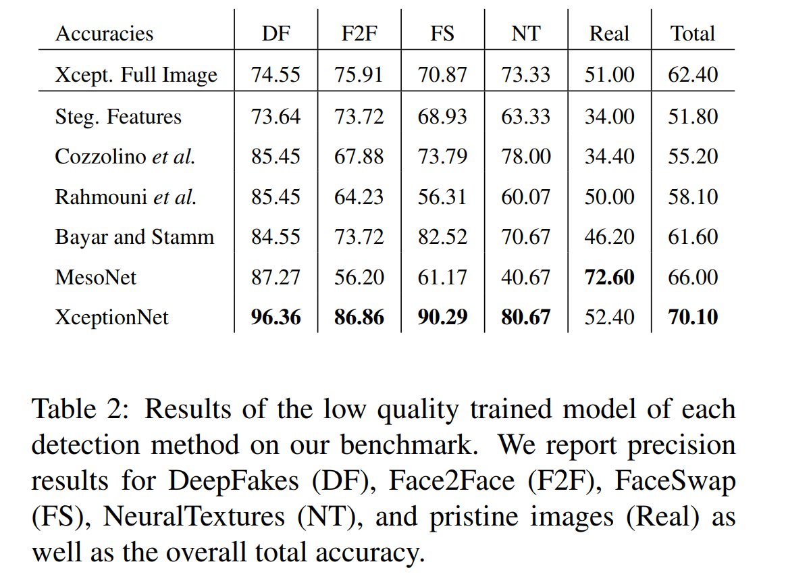
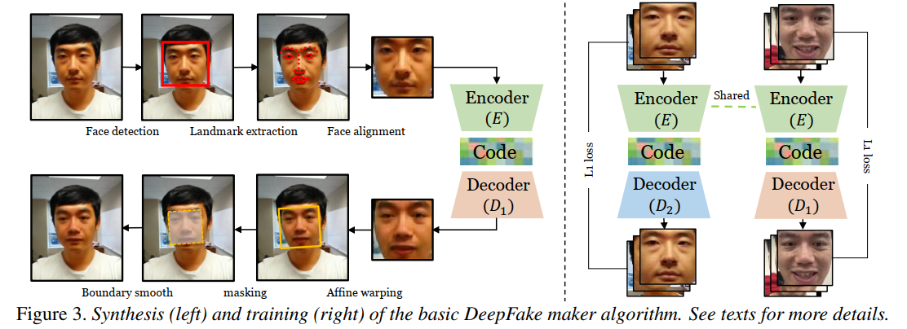
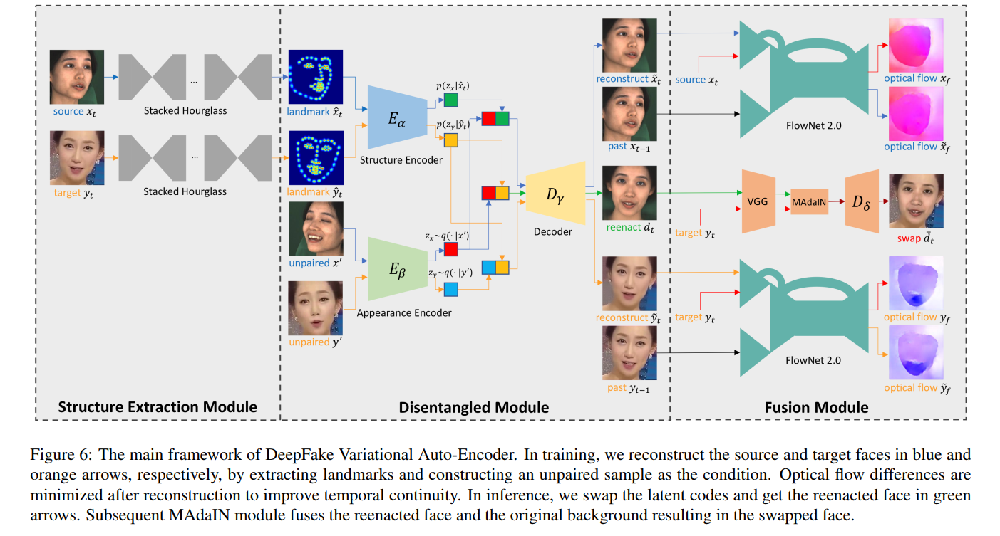

# 数据集

| dataset | publish date | conference | author |
| - | - | - | - |
| [DFD]()
| [FF++(FaceForensics++)](https://github.com/ondyari/FaceForensics) | 25 Jan 2019 | iccv19 | Andreas R¨ossler(Technical University of Munich) | 
| [Celeb-DF](http://www.cs.albany.edu/~lsw/celeb-deepfakeforensics.html) | 27 Sep 2019 | cpvr20 | Yuezun Li(University at Albany) |
| [DeeperForensics-1.0](https://github.com/EndlessSora/DeeperForensics-1.0) | 9 Jan 2020 | cvpr20 | Liming Jiang(NTU Singapore), wuwenyan(sensetime) |
| [DFDC](https://ai.facebook.com/datasets/dfdc) | 12 Jun 2020 |  | Brian Dolhansky(Facebook AI) |

## FF++

[benchmark results for the Binary Classification](http://kaldir.vc.in.tum.de/faceforensics_benchmark/)
下载benchmark图片（），然后按格式提交对每张图片的预测，即可得到结果。

```
root-dir:
    manipulated_sequences:
        DeepFakeDetection
            raw/c23/c40 # 每种方式3068个假视频，文件名包含了替换方式
                <target actor>_<source actor>__<sequence name>__<8 charactor long experiment id>.mp4
                raw/0: ~200GB
                23: ~3GB
                40: ~400MB
            mask: # 和videos相对应
        Deepfakes|Face2Face|FaceSwap|NeuralTextures
            raw/c23/c40 # 1000个视频，一对之间相互交换，四种变换均相同
                <target sequence>_<source sequence>.mp4 # source 提供人脸，target提供背景
                raw/0: ~1.6TB
                c23: ~22GB
                c40: ~3GB
            mask: # 和videos相对应
    original_sequences:
        actors/c23/videos # 16个不同场景中28位付费演员的363个原始序列
            <actor number>__<scene name>.mp4
        youtube # 都是1000个视频，分辨率不同
            < c0/raw original sequence images/videos of the FaceForensics++ dataset > 
                ~500GB
            < c23/hq original sequence images/videos >
                ~10GB
            < c40/lq original sequence images/videos >
                ~2GB
```

### 技术路线

| forensics type | publish | author | tutorial | description | 
|----------------|--------------|--------| -------- | ----- |
| [Deepfakes](https://github.com/deepfakes/faceswap)      | first commit: Dec 15, 2017    |        |         | 换脸，learning-based |
| [Faceswap](https://github.com/deepfakes/faceswap)    | the same  |        |        | 换脸，computer graphics-based |
| [Face2Face](https://openaccess.thecvf.com/content_cvpr_2016/html/Thies_Face2Face_Real-Time_Face_CVPR_2016_paper.html)  |  cvpr16     | Justus Thies(University of Erlangen-Nuremberg)  |         | 换表情，computer graphics-based |
| [NeuralTextures](https://arxiv.org/abs/1904.12356) | ACM Graphics on Transactions(28 Apr 2019)    | Justus Thies(Technical University of Munich)       |        | 换脸，learning-based |

共1000个视频，分成500对，按照360、70、70的比例划分train/test/val。
因为是两两交换，所以伪造视频也是1000个。

benchmark


更新FF++中提供的代码，可以进行二分类的训练和测试，并复现上述结果。
见[FaceForensics](https://github.com/niyunsheng/FaceForensics)

## Celeb-DF

```
root-dir:
    YouTube-real:
        00000.mp4~00299.mp4 # 共300个视频，额外的youtube下载真视频
    Celeb-real:
        id*.mp4 # youtube收集的590个原始视频
    Celeb-synthesis:
        *.mp4 # Celeb-real中的对应的5639个假视频
    List_of_testing_videos.txt # 518个视频路径
```

动机：之前的数据集质量较差，在图1中突出显示，包括低质量的合成脸部，可见的拼接边界，颜色不匹配，原始脸部的可见部分以及合成的脸部方向不一致。

来源：youtube上公开获取的59个名人的视频片段。

### 技术路线

使用改进的DeepFake合成方法生成的，59个名人，590个视频，相互交换人脸生成假视频。

原始的DeepFake技术路线如下图所示：


改进方法有以下四点：
* 提高分辨率：将合成人脸的分辨率提高到256*256，通过使用具有更多层和更大尺寸的编码器和解码器模型来实现，分辨率较高的话不仅视觉效果好，而且适应输入人脸时，调整大小和旋转操作的影响较小。
* 颜色失配：通过训练数据增强和后期处理，可以显着减少Celeb-DF中合成供体的脸部与原始目标的脸部之间的颜色失配。
* 不正确的面罩：改进面罩的生成过程，其实就是让关键点范围更大，然后用差值的方法让面罩变得更大。
* 合成视频的帧间闪烁：用卡尔曼滤波对人脸特征点进行平滑，减少不同帧检测的关键点的误差。


## DeeperForensics-1.0

[DeeperForensics Challenge 2020 @ ECCV SenseHuman Workshop](https://competitions.codalab.org/competitions/25228)

```
DeeperForensics-1.0
|--lists
   |--manipulated_videos_distortions_meta
      <several meta files of distortion information in the manipulated videos>
   |--manipulated_videos_lists
      <several lists of the manipulated videos>
   |--source_videos_lists
      <several lists of the source videos>
   |--splits
      <train, val, test data splits for your reference>
|--manipulated_videos
   <11 folders named by the type of variants for the manipulated videos>
|--source_videos
   <100 folders named by the ID of the actors for the source videos, and their subfolders named by the source video information>
|--terms_of_use.pdf
```

动机：源数据是影响视频质量的重要因素，互联网视频的缺点在于有限的姿态变化等。文章发现，构建数据集时，源脸比目标脸更重要，也就是说，源脸的表情、姿态和照明条件应更丰富。

50,000个真视频，10,000个假视频。

视频收集的要点：
* 故源视频是邀请100位演员付费录制视频，参与者也尽可能的保证性别、年龄、肤色等多样性。
* 所有的演员没有眼镜等装饰品。
* 从不同的角度设置了七个高清摄像头，前，左，左前，右，右前，斜上方，斜下方。
* 分辨率很高（1920×1080）。
* 转头，头部姿势范围为−90°至+ 90°
* 用八种表情自然地讲话：中立，愤怒，快乐，悲伤，惊讶，鄙视，厌恶，恐惧。

### 技术路线

对新技术提出的要求：
* 因为视频规模大，所以模型应该是通用可扩展的
* 解决画面风格不匹配的问题（如源和目标肤色不同）
* 应考虑生成视频的时间连续性



新提出的多对多人脸交换方法，即DeepFake变体自动编码器（DF-VAE）。包括三个部分：结构提取，解耦合，融合。

## DFDC

```
root-dir:
    part0:
        metadata.json # 保存真假视频对应信息
        *.mp4 # 10s的视频
    part1:
    ……
    part49:
```

### 技术路线

DFAE:deepfake autoencoder, DeepfaceLab and other df tools on github;
结构：1共享编码器+2解码器（针对换脸双方） 效果最好

MM/NN face swap：人脸特征点转换，图片级，视频不连续

NTH:Neural Talking Heads. 元学习，说话人脸特征学习，

FSGAN:人脸交换，光线好效果好

styleGan:根据特定描述换脸，效果最差

Audio:TTS skin

增强：几何、色彩、帧率；