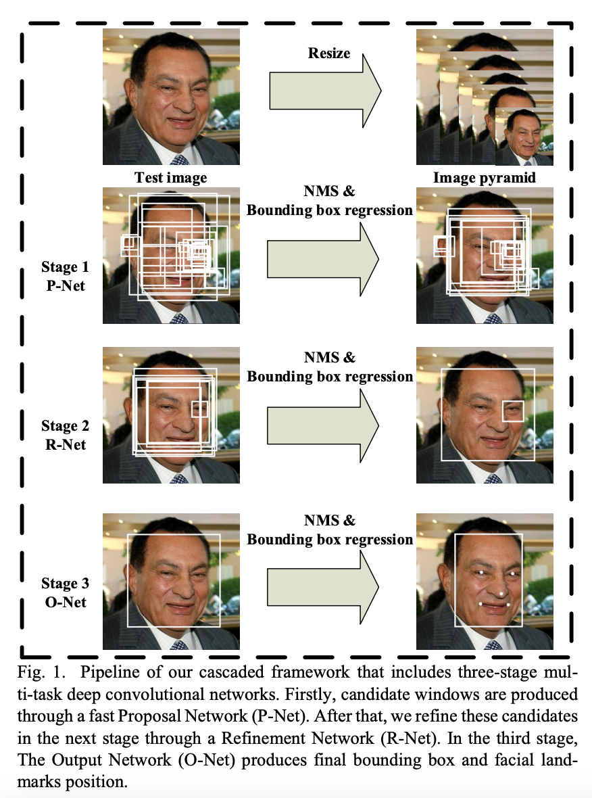
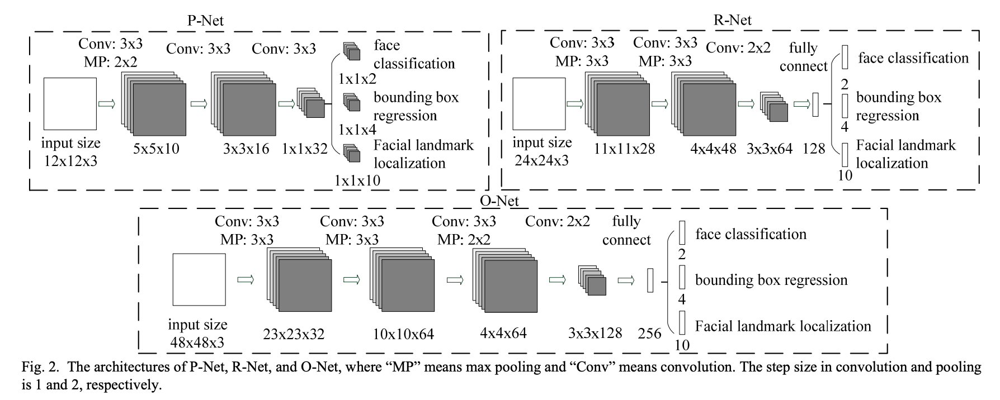
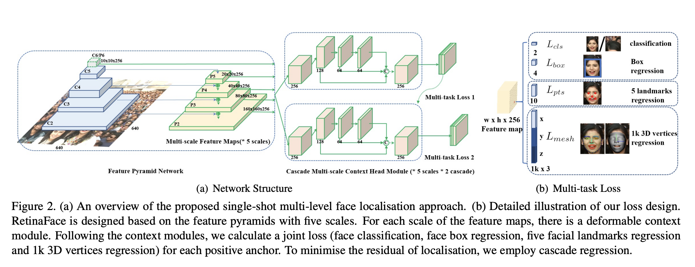

# 人脸检测

## MTCNN：Joint Face Detection and Alignment using Multi-task Cascaded Convolutional Networks

pdf:https://kpzhang93.github.io/MTCNN_face_detection_alignment/paper/spl.pdf

展示代码，用开源`facenet_pytorch`实现，[MTCNN code](./codes/mtcnn_face_detect.py)

突出点：
* multi-task：
  * detection（面部/非面部分类、边界框回归）
  * alignment（关键点定位）
* 级连网络
  * a fast Proposal Network (P-Net):通过浅CNN快速生成候选窗口
  * a Refinement Network (R-Net):通过更复杂的CNN拒绝大量非面部窗口来细化窗口
  * The Output Network (O-Net):使用更强大的CNN再次细化结果并输出五个面部标志位置
* 特征金字塔
  * 按照resize_factor（0.7左右即可）对test图片进行resize，直到大等于Pnet要求的12*12大小。这样子你会得到原图、原图*resize_factor、原图*resize_factor^2...、原图*resize_factor^n（注，最后一个的图片大小会大等于12）这些不同大小的图片。
  * 注意，这些图像都是要一幅幅输入到Pnet中去得到候选的。

训练的损失函数
* 面部/非面部分类
  * $L_{i}^{\text {det }}=-\left(y_{i}^{\text {det }} \log \left(p_{i}\right)+\left(1-y_{i}^{\text {det }}\right)\left(1-\log \left(p_{i}\right)\right)\right)$
* 边界框回归
  * $L_{i}^{b o x}=\left\|\hat{y}_{i}^{b o x}-y_{i}^{b o x}\right\|_{2}^{2}$
* 关键点回归
  * $L_{i}^{\text {landmark }}=\left\|\hat{y}_{i}^{\text {landmark }}-y_{i}^{\text {landmark }}\right\|_{2}^{2}$
* 合并的损失
  * $\min \sum_{i=1}^{N} \sum_{j \in\{\text { det }, \text { box,landmark }\}} \alpha_{j} \beta_{i}^{j} L_{i}^{j}$
  * $\alpha$表示三个任务的损失权重分布，$\beta$表示正负样本，P-Net和R-Net中使用$\alpha_{det}=1,\alpha_{box}=0.5,\alpha_{landmark}=0.5$，O-Net中使用$\alpha_{det}=1,\alpha_{box}=0.5,\alpha_{landmark}=1$
  * 正样本：三个网络均关注三个损失
  * 负样本：即背景，只计算面部/非面部分类损失，另外两个损失设置为0。

训练过程：
* 原图resize成图片金字塔
* 每张图片输入P-Net输出`m*n*16`的输出，对所有预测为人脸的图片的排序在一起（这样首先删除了预测不为人脸的框），进行nms，即首先用分类的预测分数排序，然后删除box的iou大于0.6的预测值较小的框。这样剩下的框在原图中裁好，按照长边裁正方形，然后resize为24*24.
* 将P-Net得到的所有图每个都分别输入，同样的过程映射到原图然后进行nms，再减少一部分候选框，同样是长边裁正方形，然后resize为48*48.

* 三个网络分别训练，每个网络都有自己想要的大小的图片即训练集，Pnet是`12*12*3`， Rnet是`24*24*3`， Onet是`48*48*3`的图片。然后每个网络都是单独训练的，即训练好Pnet后训练Rnet，再训练Onet，前者的训练输出是后者的训练输入。

有四种训练数据输入：
* Positive face数据：图片左上右下坐标和label的IOU>0.65的图片
* part face数据：图片左上右下坐标和label的0.65>IOU>0.4的图片
* negative face 数据：图片左上右下坐标和lable的IOU<0.3的图片
* landmark face数据：图片带有landmark label的图片

不同的训练数据的用途：
* 网络做人脸分类的时候，使用postives 和negatives的图片来做，容易使模型收敛
* 网络做人脸bbox的偏移量回归的时候，使用positives 和parts的数据
* 网络做人脸landmark 回归的时候，就只使用landmark face数据了

boxes和landmard训练数据的label如何生成：
* boxes的label标记用归一化的值进行，这样可以不受resize的干扰，假设label为：左上（xlu1， ylu2）右下（xrd，yrd2）， 截图图片实际在原图的绝对坐标为（x1， y1）（x2， y2），那么我们左上x1的offset就是定义为：(x1-xlu1)/（x2-x1）是个归一化的数据，同理可以得到左上y1右下x2、右下y2的offset。
* landmark的label也是用归一化的值进行，是标记坐标相对于真实的box左上角的相对偏移，假设landmark是(x1,y1)，则label是(x1-xlu1)/(xrd-xlu1)

对于R-Net和O-Net的训练：
* Pnet在前述数据的情况下进行训练并完成训练，我们将所有的WIDER数据和CelebA数据输入到Pnet，会得到很多的候选，去原图截图，计算截图和label的IOU，按照上述四种数据的分类标准分别区分开，同时label标注方法和上述标注方法一致。我们经过Pnet就可以得到Rnet所需的24*24大小的训练数据了。我们继续训练好Rnet。
* Onet的输入是WIDER数据集和CelebA数据集经过Pnet、Rnet后得到的在原图上截取的图片，根据IOU的不同进行分类，并resize为48*48。这样子我们再把Onet给训练好。

Hard Sample mining技巧：
* 只对分类损失进行hard sample mining，具体意思是在一个batch里面的图片数据，只取分类损失（det loss）的前70%的训练数据（这个比例是提前设好的）backprop回去。其余两类损失不做这样的hard sample mining，原因在于回归问题再微小的nudge修正都是有用的，但是二分类就未必了。

MTCNN的缺点：
* 当图像中的人脸数目比较多的时候，mtcnn人脸检测算法的的性能下降的比较快，而retinaFace算法不受人脸数量的限制，这是由于 mtcnn算法使用了图像金字塔算法，需要对图像进行多次缩放，导致前向运算次数比较多，严重拖慢了检测速度

评估指标：
* 人脸检测的主要评估指标为AP

## RetinaFace

pdf:https://openaccess.thecvf.com/content_CVPR_2020/papers/Deng_RetinaFace_Single-Shot_Multi-Level_Face_Localisation_in_the_Wild_CVPR_2020_paper.pdf

主要贡献：
* 基于单级设计，提出一个新的像素级人脸定位方法RetinaFace，利用多任务学习策略同时预测人脸评分，人脸框，5个关键点以及对应于每个人脸像素的3D位置
* 在WIDER FACE难子集上，RetinaFace的AP=91.4%,比最好的两级级联方法ISRN提升1.1%
* 在IJB-C测试集上，RetinaFace将ArcFace在人脸认证（face verification）上进一步提升（TAR=89.59%FAR=1e-6）。这表示更好的人脸定位可以显著提升人脸识别
* 通过利用轻量级的骨架网络，RetinaFace可以在单一CPU上对一张VGA分辨率的图像实时运行
* 我们手工标注了WIDER FACE数据集上的五点，在外监督信号的辅助下获得了难人脸检测的显著提升

单阶段和双阶段特点对比：
* 两阶方法如Faster RCNN和单阶方法如SSD和RetinaNet。
* 两阶方法应用一个“proposal and refinement”机制提取高精度定位。而单阶方法密集采样人脸位置和尺度，导致训练过程中极度不平衡的正样本和负样本。
* 为了处理这种不平衡，采样和re-weighting方法被广泛使用。
* 相比两阶方法，单阶方法更高效并且有更高的召回率，但是有获取更高误报率的风险，影响定位精度。

训练的损失函数
* $\begin{aligned} \mathcal{L} &=\mathcal{L}_{c l s}\left(p_{i}, p_{i}^{*}\right)+\lambda_{1} p_{i}^{*} \mathcal{L}_{b o x}\left(t_{i}, t_{i}^{*}\right) +\lambda_{2} p_{i}^{*} \mathcal{L}_{p t s}\left(l_{i}, l_{i}^{*}\right)+\lambda_{3} p_{i}^{*} \mathcal{L}_{m e s h}\left(v_{i}, v_{i}^{*}\right) \end{aligned}$
* 人脸分类损失`L_cls`
* 人脸框回归损失`L_box`，R表示smooth_L1鲁棒性回归函数
* 人脸关键点回归函数`L_pts`
* 密集回归损失`L_pixel`，投影到图像平面的3D点
* 三个超参数分别设置为0.25、0.1、0.01

通过联合外监督（extra-supervised）和自监督（self-supervised）的多任务学习，RetinaFace对各种尺度条件下的人脸可以做到像素级别的定位

retinaFace的缺点，也是目前one-stage目标检测算法的缺点
* 预设的anchor 是一柄双刃剑，anchor需要事先指定，并且不同的检测任务需要的anchor并不一样
* anchor的数量会非常的多，由于fpn根据featureMap上的每一个点生成一个anchor,即使我们用nms或者soft-nms去重，但是负样本的数量依然非常非常多，与正样本比例严重失衡，所以诸如RetinaNet等网络的工作都是想办法去采取合适的比例参数平衡这个差异。
* Anchor数量巨多，需要每一个都进行IOU计算，耗费巨大的算力，降低了效率，步骤十分繁琐，而这些冗余其实是可以消灭的。以上是anchor非常明显的缺点，所以anchor-free模型开始兴起，它的兴起，一方面说明anchor-based固有的缺陷需要改正；另一方面说明现有的anchor-based方法已经有了很高的baseline，不好继续突破。