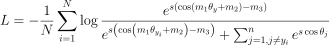

# 人脸识别损失

<!-- $$L=-\frac{1}{N} \sum_{i=1}^{N} \log \frac{e^{s\left(\cos \left(m_{1} \theta_{y}+m_{2}\right)-m_{3}\right)}}{e^{s\left(\cos \left(m_{1} \theta_{y_{i}}+m_{2}\right)-m_{3}\right)}+\sum_{j=1, j \neq y_{i}}^{n} e^{s \cos \theta_{j}}}$$ -->

| loss name    | w_norm | x_norm | s    | m1   | m2   | m3   |
| ------------ | ------ | ------ | ---- | ---- | ---- | ---- |
| softmax      | False  | False  | 1    | 1    | 0    | 0    |
| L-softmax_v1 | False  | False  | 1    | 2    | 0    | 0    |
| A-softmax_v1 | True   | False  | 1    | 2    | 0    | 0    |
| A-softmax_v2 | True   | False  | 1    | 3    | 0    | 0    |
| norm-softmax | True   | True   | 1    | 1    | 0    | 0    |
| CosFace_v1   | True   | True   | 4    | 1    | 0    | 0.1  |
| CosFace_v2   | True   | True   | 4    | 1    | 0    | 0.2  |
| ArcFace_v1   | True   | True   | 4    | 1    | 0.1  | 0    |
| ArcFace_v2   | True   | True   | 4    | 1    | 0.2  | 0    |
| ArcFace_v3   | True   | True   | 4    | 1    | 0.3  | 0    |