# 人脸识别

| model | conference | paper | first author | institute | loss fun |
| - | - | - | - | - | - |
| DeepFace | CVPR 2014 | DeepFace: Closing the Gap to Human-Level Performance in Face Verification | Yaniv Taigman | Facebook AI Lab | sofrmax loss + contrastive loss |
| DeepID1 | CVPR 2014 | Deep Learning Face Representation from Predicting 10,000 Classes | Yi Sun | The Chinese University of Hongkong | sofrmax loss + contrastive loss |
| DeepID2 | NIPS 2014 | Deep Learning Face Representation by Joint Identification-Verification | Yi Sun | The Chinese University of Hongkong | sofrmax loss + contrastive loss |
| FaceNet | CVPR 2015 | FaceNet: A Unified Embedding for Face Recognition and Clustering | Florian Schroff | google | triplet loss |
| CenterLoss | ECCV 2016 | A Discriminative Feature Learning Approach for Deep Face Recognition | Yandong Wen | Shenzhen key lab of computer Vision and Pattern recognition | center loss |
| L-sofrmaxLoss | ICML 2016 | Large-Margin Softmax Loss for Convolutional Neural Networks | Weiyang Liu & Yandong Wen | Peking Uiversity, South China University of Technology | L-softmax loss |
| SphereFace | CVPR 2017 | SphereFace: Deep Hypersphere Embedding for Face Recognition | Weiyang Liu | Georgia Institute of Technology | A-softmax loss |
| CosFace | CVPR 2018 | CosFace: Large Margin Cosine Loss for Deep Face Recognition | Hao Wang | Tencent AI Lab | large margin cosine loss |
| ArcFace | CVPR 2019 | ArcFace: Additive Angular Margin Loss for Deep Face Recognition | Jiankang Deng & Jia Guo | Imperial College London, InsightFace | additive angular margin loss |

人脸识别属于度量学习的范畴，学习到的人脸特征具有以下特点
* Intra-class Compactness 
* Inter-class Discrepancy

Comparison of open-set and closed-set recognition
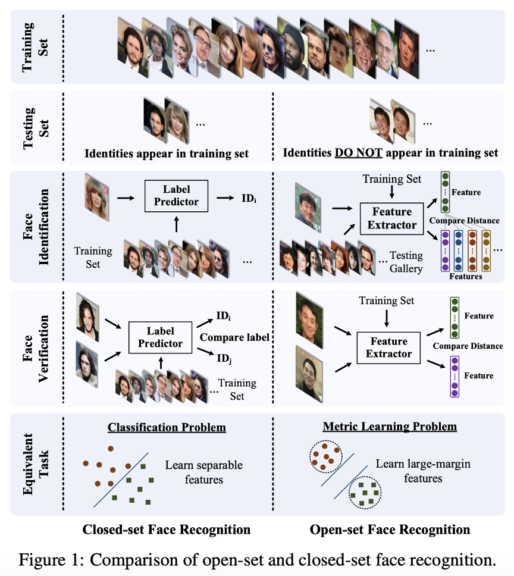

## Contrastive Loss

$$
\begin{array}{l}
\operatorname{Ident}\left(f, t, \theta_{i d}\right)=-\sum_{i=1}^{n}-p_{i} \log \hat{p}_{i}=-\log \hat{p}_{t} \\
\operatorname{Verif}\left(f_{i}, f_{j}, y_{i j}, \theta_{v e}\right)=\left\{\begin{array}{ll}
\frac{1}{2}\left\|f_{i}-f_{j}\right\|_{2}^{2} & \text { if } y_{i j}=1 \\
\frac{1}{2} \max \left(0, m-\left\|f_{i}-f_{j}\right\|_{2}\right)^{2} & \text { if } y_{i j}=-1
\end{array}\right.
\end{array}
$$

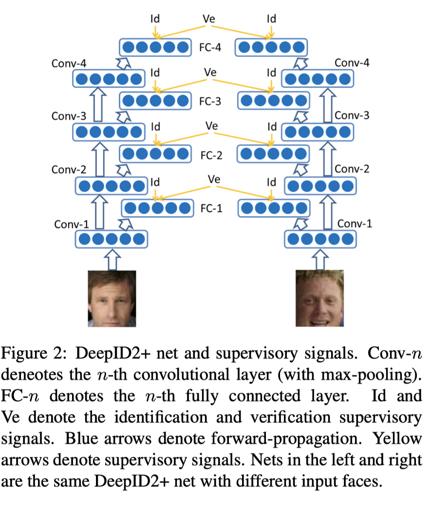

## Triplet Loss

$$
\sum_{i}^{N}\left[\left\|f\left(x_{i}^{a}\right)-f\left(x_{i}^{p}\right)\right\|_{2}^{2}-\left\|f\left(x_{i}^{a}\right)-f\left(x_{i}^{n}\right)\right\|_{2}^{2}+\alpha\right]_{+}
$$

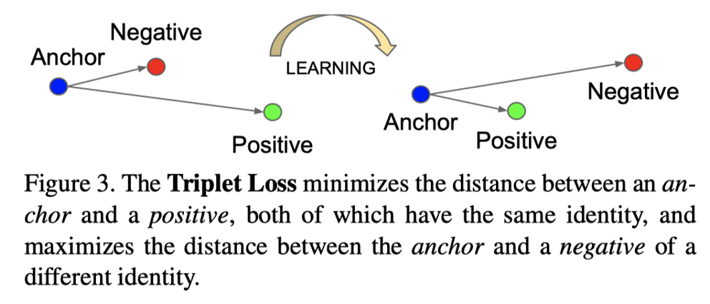

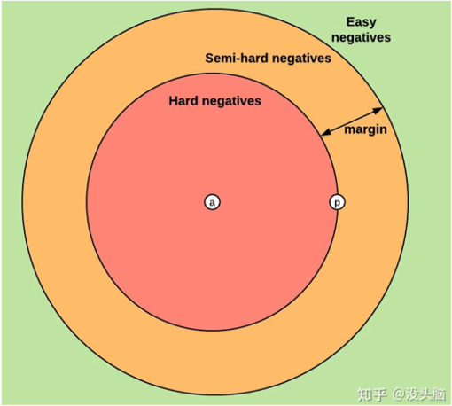

## Center Loss

$$
\begin{aligned}
\mathcal{L}_{C}=& \frac{1}{2} \sum_{i=1}^{m}\left\|\boldsymbol{x}_{i}-\boldsymbol{c}_{y_{i}}\right\|_{2}^{2} \\
\Delta \boldsymbol{c}_{j}=& \frac{\sum_{i=1}^{m} \delta\left(y_{i}=j\right) \cdot\left(\boldsymbol{c}_{j}-\boldsymbol{x}_{i}\right)}{1+\sum_{i=1}^{m} \delta\left(y_{i}=j\right)} \\
\mathcal{L}=& \mathcal{L}_{S}+\lambda \mathcal{L}_{C} \\
=-& \sum_{i=1}^{m} \log \frac{e^{W_{y_{i}}^{T} \boldsymbol{x}_{i}+b_{y_{i}}}}{\sum_{j=1}^{n} e^{W_{j}^{T} \boldsymbol{x}_{i}+b_{j}}}+\frac{\lambda}{2} \sum_{i=1}^{m}\left\|\boldsymbol{x}_{i}-\boldsymbol{c}_{y_{i}}\right\|_{2}^{2}
\end{aligned}
$$

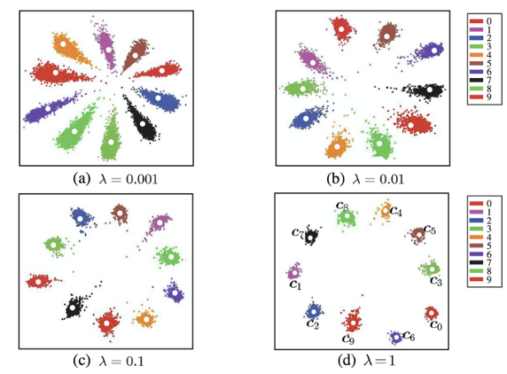

## L-Softmax Loss

$$
\begin{array}{l}
\left\|\boldsymbol{W}_{1}\right\|\|\boldsymbol{x}\| \cos \left(\theta_{1}\right)>\left\|\boldsymbol{W}_{2}\right\|\|\boldsymbol{x}\| \cos \left(\theta_{2}\right) \\
 \\
\begin{aligned}
\left\|\boldsymbol{W}_{1}\right\|\|\boldsymbol{x}\| \cos \left(\theta_{1}\right) & \geq\left\|\boldsymbol{W}_{1}\right\|\|\boldsymbol{x}\| \cos \left(m \theta_{1}\right) \\
&>\left\|\boldsymbol{W}_{2}\right\|\|\boldsymbol{x}\| \cos \left(\theta_{2}\right)
\end{aligned} \\
L_{i}=-\log \left(\frac{e^{\left\|\boldsymbol{W}_{y_{i}}\right\|\left\|\boldsymbol{x}_{i}\right\| \psi\left(\theta_{y_{i}}\right)}}{e^{\left\|\boldsymbol{W}_{y_{i}}\right\|\left\|\boldsymbol{x}_{i}\right\| \psi\left(\theta_{y_{i}}\right)}+\sum_{j \neq y_{i}} e^{\left\|\boldsymbol{W}_{j}\right\|\left\|\boldsymbol{x}_{i}\right\| \cos \left(\theta_{j}\right)}}\right)
\end{array} \\
\psi(\theta)=\left\{\begin{array}{l}
\cos (m \theta), \quad 0 \leq \theta \leq \frac{\pi}{m} \\
\mathcal{D}(\theta), \quad \frac{\pi}{m}<\theta \leq \pi
\end{array}\right. \\
\psi(\theta)=(-1)^{k} \cos (m \theta)-2 k, \quad \theta \in\left[\frac{k \pi}{m}, \frac{(k+1) \pi}{m}\right] \\
$$

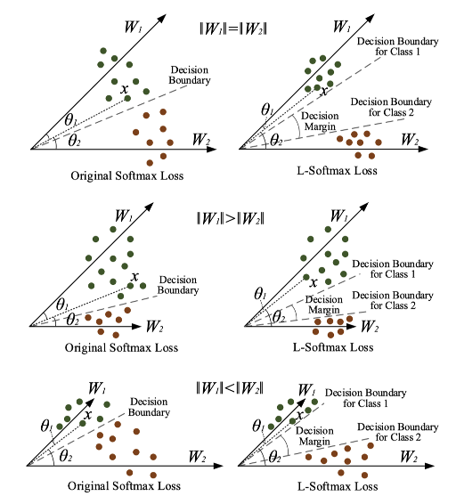

## SphereFace

$$
\begin{aligned}
&\text { Weight Norm and zero bias } \quad\left\|\boldsymbol{W}_{i}\right\|=1, b_{i}=0\\
&\text { Classification boundary } \cos \left(m \theta_{1}\right)=\cos \left(\theta_{2}\right)\\
&L_{\mathrm{ang}}=\frac{1}{N} \sum_{i}-\log \left(\frac{e^{\left\|\boldsymbol{x}_{i}\right\| \psi\left(\theta_{y_{i}, i}\right)}}{e^{\left\|\boldsymbol{x}_{i}\right\| \psi\left(\theta_{y_{i}, i}\right)}+\sum_{j \neq y_{i}} e^{\left\|\boldsymbol{x}_{i}\right\| \cos \left(\theta_{j, i}\right)}}\right)
\end{aligned}
$$

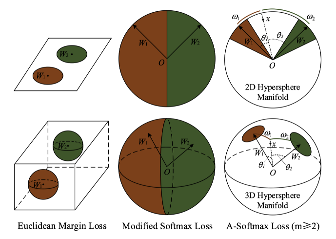

## CosFace

Weight Norm and Feature Norm 
$$
\begin{aligned}
W &=\frac{W^{*}}{\left\|W^{*}\right\|} \\
x &=\frac{x^{*}}{\left\|x^{*}\right\|} \\
\cos \left(\theta_{j}, i\right) &=W_{j}^{T} x_{i}
\end{aligned}
$$

classification boundary
$$
\cos \left(\theta_{1}\right)-m>\cos \left(\theta_{2}\right) \text { and } \cos \left(\theta_{2}\right)-m>\cos \left(\theta_{1}\right)
$$

loss function
$$
L_{l m c}=\frac{1}{N} \sum_{i}-\log \frac{e^{s\left(\cos \left(\theta_{y_{i}, i}\right)-m\right)}}{e^{s\left(\cos \left(\theta_{y_{i}, i}\right)-m\right)}+\sum_{j \neq y_{i}} e^{s \cos \left(\theta_{j, i}\right)}}
$$

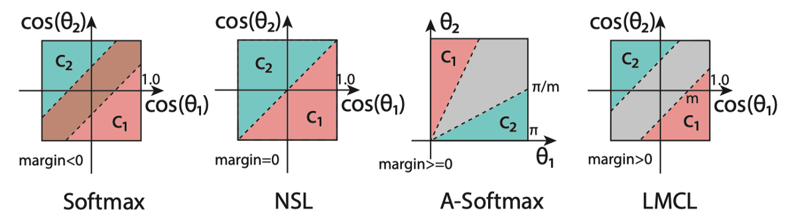

## Arcface

$$
\begin{array}{l}
\cos \left(\theta_{1}-m\right)>\cos \left(\theta_{2}\right) \\
L_{3}=-\frac{1}{N} \sum_{i=1}^{N} \log \frac{e^{s\left(\cos \left(\theta_{y_{i}}+m\right)\right)}}{e^{s\left(\cos \left(\theta_{y_{i}}+m\right)\right)}+\sum_{j=1, j \neq y_{i}}^{n} e^{s \cos \theta_{j}}} . \\
L_{4}=-\frac{1}{N} \sum_{i=1}^{N} \log \frac{e^{s\left(\cos \left(m_{1} \theta_{y_{i}}+m_{2}\right)-m_{3}\right)}}{\left.e^{s\left(\cos \left(m_{1} \theta_{j_{i}}+m_{2}\right)-m_{3}\right.}\right)+\sum_{j=1, j \neq y_{i}}^{n} e^{s \cos \theta_{j}}} .
\end{array}
$$

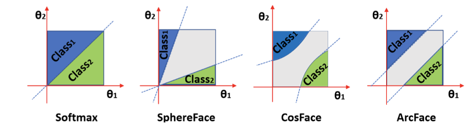

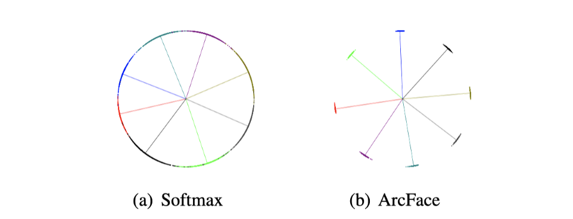

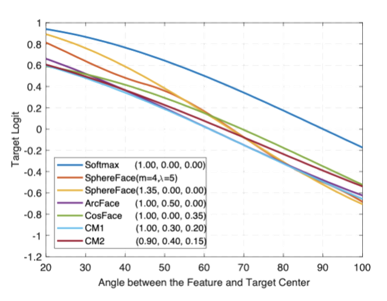

## 人脸损失可视化

采用通用的人脸损失公式，采用不同的参数如下，在minist上的可视化效果见[Visualization of Face Loss](https://github.com/niyunsheng/Visualization-of-Face-Losses)

| loss name    | w_norm | x_norm | s    | m1   | m2   | m3   |
| ------------ | ------ | ------ | ---- | ---- | ---- | ---- |
| softmax      | False  | False  | 1    | 1    | 0    | 0    |
| L-softmax_v1 | False  | False  | 1    | 2    | 0    | 0    |
| A-softmax_v1 | True   | False  | 1    | 2    | 0    | 0    |
| A-softmax_v2 | True   | False  | 1    | 3    | 0    | 0    |
| norm-softmax | True   | True   | 1    | 1    | 0    | 0    |
| CosFace_v1   | True   | True   | 4    | 1    | 0    | 0.1  |
| CosFace_v2   | True   | True   | 4    | 1    | 0    | 0.2  |
| ArcFace_v1   | True   | True   | 4    | 1    | 0.1  | 0    |
| ArcFace_v2   | True   | True   | 4    | 1    | 0.2  | 0    |
| ArcFace_v3   | True   | True   | 4    | 1    | 0.3  | 0    |