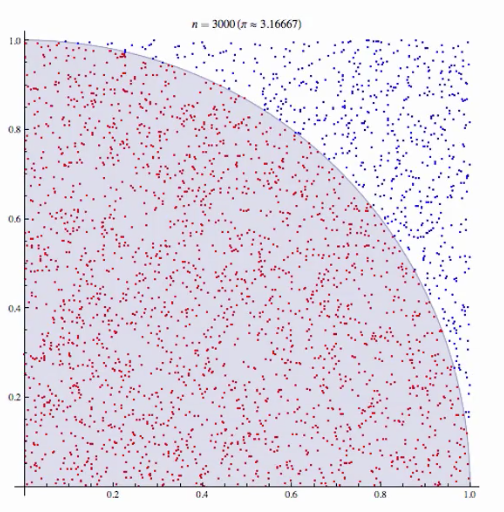

# 蒙特卡洛(Monte Carlo)

## 蒙特卡洛模拟(Monte Carlo Simulation)

蒙特卡洛模拟是一种统计学的方法，用来模拟大量数据，使其符合某种分布。

> 蒙特卡洛模拟是在二战期间，当时在原子弹研制的项目中，为了模拟裂变物质的中子随机扩散现象，由美国数学家冯·诺伊曼（学计算机的同学都知道这位冯同志的大名，人称“计算机之父”）和乌拉姆等发明的一种统计方法。之所以起名叫蒙特卡洛模拟，是因为蒙特卡洛在是欧洲袖珍国家摩纳哥一个城市，这个城市在当时是非常著名的一个赌城。因为赌博的本质是算概率，而蒙特卡洛模拟正是以概率为基础的一种方法，所以用赌城的名字为这种方法命名。[link](https://zhuanlan.zhihu.com/p/34217180)

## 蒙特卡洛方法(Monte Carlo Method)

一种**以概率统计理论为指导**的数值计算方法。是指使用随机数（或更常见的伪随机数）来解决很多计算问题的方法。

> 蒙特卡罗算法：采样越多，越近似最优解；
> 拉斯维加斯算法：采样越多，越有机会找到最优解；

两个步骤：
* 不断的抽样
* 逐渐逼近

举例1：用蒙特卡洛算法估算圆周率π



前提：需要一个产生均匀分布的随机数。

```python
import random
total = 1e8
in_cnt = 0
for _ in range(total):
    x = random.random()
    y = random.random()
    dis = (x**2+y**2)**0.5
    if dis <= 1:
        in_cnt += 1
print("pi is:",in_cnt/total)
```

举例2：计算积分面积
* 随机打点
* 计算打点是否在积分区域
* 即可得到积分区域的面积占总面积的比例，乘以总面积即得积分面积

## 蒙特卡洛搜索树(Monte Carlo Tree Search)

机器下棋的算法本质都是搜索树，围棋难在它的树宽可以达到好几百（国际象棋只有几十）。在有限时间内要遍历这么宽的树，就只能牺牲深度（俗称“往后看几步”），但围棋又是依赖远见的游戏，甚至不仅是看“几步”的问题。所以，要想保证搜索深度，就只能放弃遍历，改为随机采样——这就是为什么在没有MCTS（蒙特卡罗搜树）类的方法之前，机器围棋的水平几乎是笑话。而采用了MCTS方法后，搜索深度就大大增加了。[link](https://www.zhihu.com/question/20254139/answer/33572009)

