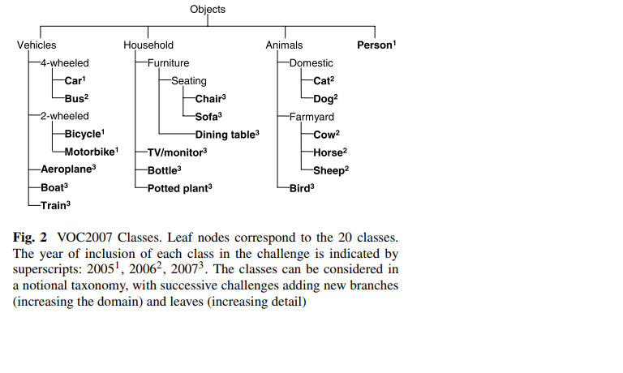

# 物体检测数据集和评价指标

## PASCAL VOC

[pascal VOC](http://host.robots.ox.ac.uk/pascal/VOC/)

PASCAL VOC为图像分类与物体检测提供了一整套标准的数据集，并从2005年到2012年每年都举行一场图像检测竞赛。 PASCAL全称为Pattern Analysis,Statistical Modelling and Computational Learning，是一个由欧盟资助的网络组织。 其中常用的数据集主要有VOC 2007与VOC 2012两个版本。

文件组织如下：
```
VOC2007
    Annotations # 共5011个xml文件
        000005.xml # 描述文件000005.jpg的bbox等信息
        ……
    ImageSets
        Layout
            train.txt
            trainval.txt # trainval是train和val的总和
            val.txt
        Main
            person_train.txt
            person_trainval.txt
            person_val.txt
            …… 等共20类的信息
        Segmentation
            train.txt
            trainval.txt
            val.txt
    JPEGImages # 共5011个jpg文件
        000005.jpg
        …… 
    SegmentationClass 共422个png文件
        000032.png
        …… 
    SegmentationObject 共422个png文件，和SegmentationClass中的图片完全相同
        000032.png
        ……
VOC2012
    Annotations # 共17125个xml文件
        2007_000033.xml # 描述文件2007_000033.jpg的bbox等信息
        ……
    ImageSets
        Action
        Layout
            train.txt
            trainval.txt
            val.txt
        Main
            person_train.txt
            person_trainval.txt
            person_val.txt
            …… 等共20类的信息
        Segmentation
            train.txt
            trainval.txt
            val.txt
    JPEGImages # 共17125个jpg文件
        2007_000033.jpg
        …… 
    SegmentationClass 共2913个png文件
        2010_004363.png 
        …… 
    SegmentationObject 共2913个png文件，和SegmentationClass中的图片完全相同
        2010_004363.png
        ……
```

从voc2007开始，都是有20个类别，类别的组织如下：



这20个类别中，预测是只输出黑色粗体的类别。

voc2007：train/val/test共有9963张图片，包含24640个已标注的object。2007之前的test是公布的，其后的没有公布。

voc2012：train/val共有11540张图片，包含27450个已被标注的ROI annotated objects。

voc2007和voc2012的图片是互斥的，所以具体用法有：
* 只用VOC2007的trainval 训练，使用VOC2007的test测试
* 只用VOC2012的trainval 训练，使用VOC2012的test测试，这种用法很少使用，因为大家都会结合VOC2007使用
* 使用 VOC2007 的 train+val 和 VOC2012的 train+val 训练，然后使用 VOC2007的test测试，这个用法是论文中经常看到的 07+12 ，研究者可以自己测试在VOC2007上的结果，因为VOC2007的test是公开的。
* 使用 VOC2007 的 train+val+test 和 VOC2012的 train+val训练，然后使用 VOC2012的test测试，这个用法是论文中经常看到的 07++12 ，这种方法需提交到VOC官方服务器上评估结果，因为VOC2012 test没有公布。
* 先在 MS COCO 的 trainval 上预训练，再使用 VOC2007 的 train+val、 VOC2012的 train+val 微调训练，然后使用 VOC2007的test测试，这个用法是论文中经常看到的 07+12+COCO 。
* 先在 MS COCO 的 trainval 上预训练，再使用 VOC2007 的 train+val+test 、 VOC2012的 train+val 微调训练，然后使用 VOC2012的test测试 ，这个用法是论文中经常看到的 07++12+COCO，这种方法需提交到VOC官方服务器上评估结果，因为VOC2012 test没有公布。

PASCAL 2007竞赛包括四项：
* 分类任务
  * 对于二十个对象类别中的每一个，预测测试图像中该类别的至少一个对象的存在/不存在。
* 检测任务
  * 对于这二十个类别中的每一个，预测测试图像（如果有）中该类别的每个对象的边界框。每个边界框应以检测的相关实值置信度输出，以便可以绘制精度/召回曲线。参与者可以选择解决所有或任何类别的对象类别，例如``仅汽车''或``摩托车和汽车''。
* 分割任务
  * 对于每个测试图像像素，如果对象不属于二十个指定的类别之一，则预测包含该像素或“背景”的对象的类别。系统的输出应该是索引图像，每个像素索引指示推断类的数量（1-20）或零，指示背景。
* 人物布局检测任务
  * 对于测试图像（如果有）中的每个“人”对象，检测到该人，预测该人的边界框，各部分（头部/手/脚）的存在/不存在以及这些部分的边界框。每个人的检测都应以检测的相关实值置信度输出，以便可以绘制精确度/召回率曲线。该任务仅是对“ person”类的检测任务的扩展。

PASCAL 2012竞赛包括六项（相比2007增加两项）：
* 分类任务
* 检测任务
* 分隔任务
* 人物布局检测任务
* 动作分类任务
  * 对于十个动作类别中的每一个，预测测试图像中的指定人（由其边界框指示）是否正在执行相应的动作。系统的输出应该是正在执行操作的实值置信度，以便可以绘制精度/调用曲线。参与者可以选择解决所有或任何类别的动作类，例如`仅行走`或`行走与跑步`。
* 无边框动作分类任务
  * 无框动作分类任务与动作分类任务相同，除了要在测试图像中分类的人仅由位于其身体某处的单个点而不是紧紧的边界框来指示。


## MS COCO

[Microsoft Common Objects in Context](https://cocodataset.org/#home)

起源于是微软于2014年出资标注的Microsoft COCO数据集，与ImageNet 竞赛一样，被视为是计算机视觉领域最受关注和最权威的比赛之一。

包括三个任务，对应不同的annotations文件。
1. 目标检测和图像分割
2. 图像标注，用一句话描述图片上的信息
3. 人体关键点检测，定位人体在哪里，以及人体的关键点信息

文件组织如下：
```
```

参考：
* [目标检测数据集PASCAL VOC简介](https://arleyzhang.github.io/articles/1dc20586/)