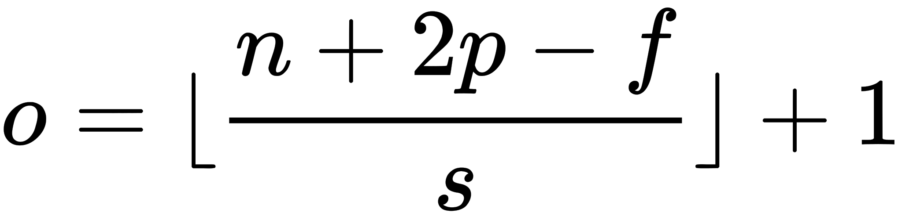

# pytorch

## torch.Tensor

* `abs()`, the same as `torch.abs()`
* `abs_()`
* `acos()`
* `acos_()`
* `asin()`
* `asin_()`

## nn.functional

### normalize

`torch.nn.functional.normalize(input: torch.Tensor, p: float = 2, dim: int = 1, eps: float = 1e-12, out: Optional[torch.Tensor] = None) → torch.Tensor`

对维度 `dim` 进行 $L_p$ 正则化

$$
v=\frac{v}{\max \left(\|v\|_{p}, \boldsymbol{\epsilon}\right)}
$$

### linear

`torch.nn.functional.linear(input: torch.Tensor, weight: torch.Tensor, bias: Optional[torch.Tensor] = None) → torch.Tensor`

* input: (N, *, in_features), * means any number of
* weights: (out_features,in_features)
* output: (N,∗,out_features)

$$
y=x A^{T}+b
$$

## nn.init

### uniform & normal

$U(a,b)$

`torch.nn.init.uniform_(tensor: torch.Tensor, a: float = 0.0, b: float = 1.0) → torch.Tensor`

$N(mean,std^2)$

`torch.nn.init.normal_(tensor: torch.Tensor, mean: float = 0.0, std: float = 1.0) → torch.Tensor`

### xavier_uniform & xavier_normal

基本思想：通过网络层时，输入和输出的方差相同，包括前向传播和后向传播。

$$
bound=gain * \sqrt{\frac{6}{fan\_in + fan\_out}}
$$

$$
std=gain * \sqrt{\frac{2}{fan\_in + fan\_out}}
$$

`torch.nn.init.xavier_normal_(tensor: torch.Tensor, gain: float = 1.0) → torch.Tensor`

### kaiming_uniform & kaiming_normal

$$
bound = gain * \sqrt{\frac{3}{fan\_mode}}
$$

`torch.nn.init.kaiming_uniform_(tensor, a=0, mode='fan_in', nonlinearity='leaky_relu')`

$$
bound = \frac{gain}{\sqrt{fan\_mode}}
$$

`torch.nn.init.kaiming_normal_(tensor, a=0, mode='fan_in', nonlinearity='leaky_relu')`

### constant

`torch.nn.init.constant_(tensor: torch.Tensor, val: float) → torch.Tensor`

`torch.nn.init.ones_(tensor: torch.Tensor) → torch.Tensor`

`torch.nn.init.zeros_(tensor: torch.Tensor) → torch.Tensor`

## nn

### `nn.Conv2d`

### `nn.MaxPool2d`和`nn.AvgPool2d`

公式和conv2d相同

### `nn.AdaptiveAvgPool2d`

`torch.nn.AdaptiveAvgPool2d(output_size: Union[T, Tuple[T, ...]])`

给出输出的大小，自适应算法能够自动帮助我们计算核的大小和每次移动的步长。