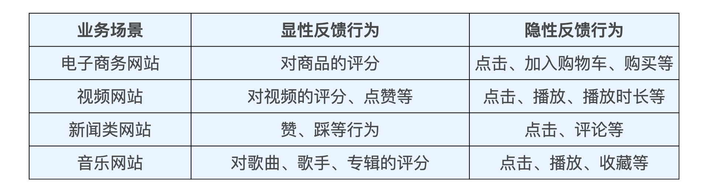
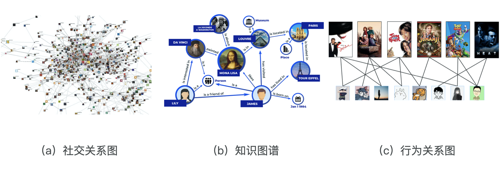
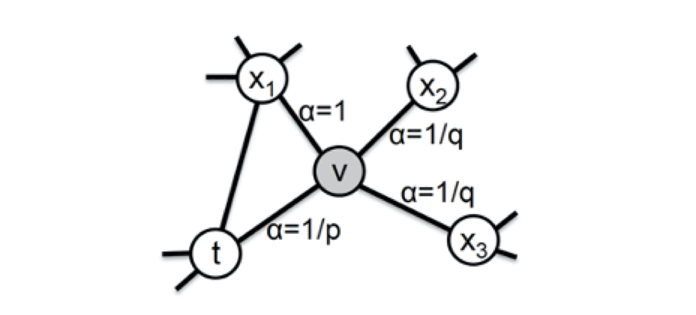

# 王喆：深度学习推荐系统

https://time.geekbang.org/column/article/288904

推荐系统要处理的问题就可以被形式化地定义为：对于某个用户U（User），在特定场景C（Context）下，针对海量的“物品”信息构建一个函数 ，预测用户对特定候选物品I（Item）的喜好程度，再根据喜好程度对所有候选物品进行排序，生成推荐列表的问题。

上述定义可以用下图表示：

深度学习的特点：数据驱动，拟合任意的函数。

传统的推荐和基于深度学习的推荐的区别可用下图概括：

在实际的推荐系统中，工程师需要着重解决的问题有两类。
* 一类问题与数据和信息相关，即“用户信息”“物品信息”“场景信息”分别是什么？如何存储、更新和处理数据？
* 另一类问题与推荐系统算法和模型相关，即推荐系统模型如何训练、预测，以及如何达成更好的推荐效果？

深度学习对于推荐系统的革命集中在模型部分，那具体都有什么呢？我把最典型的深度学习应用总结成了 3 点：
1. **深度学习中 Embedding 技术在召回层的应用。作为深度学习中非常核心的 Embedding 技术，将它应用在推荐系统的召回层中，做相关物品的快速召回，已经是业界非常主流的解决方案了。**
2. 不同结构的深度学习模型在排序层的应用。排序层（也称精排层）是影响推荐效果的重中之重，也是深度学习模型大展拳脚的领域。深度学习模型的灵活性高，表达能力强的特点，这让它非常适合于大数据量下的精确排序。深度学习排序模型毫无疑问是业界和学界都在不断加大投入，快速迭代的部分。
3. 增强学习在模型更新、工程模型一体化方向上的应用。增强学习可以说是与深度学习密切相关的另一机器学习领域，它在推荐系统中的应用，让推荐系统可以在实时性层面更上一层楼。

Sparrow Recsys系统学习：
* github：https://github.com/mJackie/RecSys
* 用具体的技术选型，把上节课的深度学习推荐系统架构图给填上得到的，架构图如下：

## 特征工程

### 推荐系统中常用的特征

有五大类：
1. 用户行为数据

2. 用户关系数据

用户关系数据也可以分为“显性”和“隐性”两种，或者称为“强关系”和“弱关系”。用户与用户之间可以通过“关注”“好友关系”等连接建立“强关系”，也可以通过“互相点赞”“同处一个社区”，甚至“同看一部电影”建立“弱关系”。在推荐系统中，利用用户关系数据的方式也是多种多样的，比如可以将用户关系作为召回层的一种物品召回方式；也可以通过用户关系建立关系图，使用 Graph Embedding 的方法生成用户和物品的 Embedding；还可以直接利用关系数据，通过“好友”的特征为用户添加新的属性特征；甚至可以利用用户关系数据直接建立社会化推荐系统。

3. 属性、标签类数据

4. 内容类数据

内容类数据（Content Data）可以看作属性标签型特征的延伸，同样是描述物品或用户的数据，但相比标签类特征，内容类数据往往是大段的描述型文字、图片，甚至视频。一般来说，内容类数据无法直接转换成推荐系统可以“消化”的特征，需要通过自然语言处理、计算机视觉等技术手段提取关键内容特征，再输入推荐系统。

5. 场景信息（上下文信息）

最后一大类是场景信息，或称为上下文信息（Context Information），它是描述推荐行为产生的场景的信息。最常用的上下文信息是“时间”和通过 GPS、IP 地址获得的“地点”信息。根据推荐场景的不同，上下文信息的范围极广，除了我们上面提到的时间和地点，还包括“当前所处推荐页面”“季节”“月份”“是否节假日”“天气”“空气质量”“社会大事件”等等。

### 用spark处理海量数据的特征

Spark 是一个分布式计算平台，通过创建任务DAG图的方式来并行执行数据处理任务。所谓分布式，指的是计算节点之间不共享内存，需要通过网络通信的方式交换数据。Spark 最典型的应用方式就是建立在大量廉价的计算节点上，这些节点可以是廉价主机，也可以是虚拟的 Docker Container（Docker 容器）。

hadoop包含两部分，一是分布式文件系统hdfs,一部是分布式计算框，就是**mapreduce**。
详见[mapreduce](mapreduce.md)

Spark 是专为大规模数据处理而设计的快速通用的计算引擎。Spark拥有Hadoop MapReduce所具有的优点，Spark在Job中间输出结果可以保存在内存中，从而不再需要读写HDFS，因此Spark性能以及运算速度高于MapReduce。

### 特征工程

离散化、归一化、非线性变换（比如取根号、平方、指数等），one-hot、embedding等。

在经典的 YouTube 深度推荐模型中，我们就可以看到一些很有意思的处理方法。比如，在处理观看时间间隔（time since last watch）和视频曝光量（#previous impressions）这两个特征的时，YouTube 模型对它们进行归一化后，又将它们各自处理成了三个特征（下图 中红框内的部分）。**无论是平方还是开方操作，改变的还是这个特征值的分布，这些操作与分桶操作一样，都是希望通过改变特征的分布，让模型能够更好地学习到特征内包含的有价值信息。但由于我们没法通过人工的经验判断哪种特征处理方式更好，所以索性把它们都输入模型，让模型来做选择**。

“特征处理没有标准答案，需要根据模型效果实践出真知”。

### Embedding

Embedding 就是用一个数值向量“表示”一个对象（Object）的方法，，我这里说的对象可以是一个词、一个物品，也可以是一部电影等等。**embedding技术用于找回层实现快速召回**。

embedding的两个特点：首先，Embedding 是处理稀疏特征的利器，其次，Embedding 可以融合大量有价值信息，本身就是极其重要的特征向量。相比由原始信息直接处理得来的特征向量，Embedding 的表达能力更强，特别是 Graph Embedding 技术被提出后，Embedding 几乎可以引入任何信息进行编码，使其本身就包含大量有价值的信息，所以通过预训练得到的 Embedding 向量本身就是极其重要的特征向量。

#### 经典的Embedding方法：Word2vec

具体包括两种方法：Continuous Bag of Words (CBOW) and skip-gram

word2vec结构的本质就是一个三层的神经网络，其中embedding matrix就是查找表，其中每一行就是对应单词的词向量。

Word2vec 还有很多值得挖掘的东西，比如，为了节约训练时间，Word2vec 经常会采用负采样（Negative Sampling）或者分层 softmax（Hierarchical Softmax）的训练方法。关于这一点，需要读《Word2vec Parameter Learning Explained》这篇文章。

比如我们想训练一个电商网站中关键词的 Embedding 模型，那么电商网站中所有物品的描述文字就是很好的语料库。

word2vec可以对词序列中的词进行embedding，那么，购物网站上用户购物的序列，看电视的观看顺序的序列，也都存在相应的embedding方法。微软2015年提出的item2vec方法，就是对word2vec的推广，使 Embedding 方法适用于几乎所有的序列数据。Item2Vec 模型的技术细节几乎和 Word2vec 完全一致，只要能够用序列数据的形式把我们要表达的对象表示出来，再把序列数据“喂”给 Word2vec 模型，我们就能够得到任意物品的 Embedding 了。

#### 利用图结构数据生成Graph Embedding

互联网上有各种各样的图结构信息，最典型的就是我们每天都在使用的社交网络（如图a）。从社交网络中，我们可以发现意见领袖，可以发现社区，再根据这些“社交”特性进行社交化的推荐，如果我们可以对社交网络中的节点进行 Embedding 编码，社交化推荐的过程将会非常方便。
知识图谱也是近来非常火热的研究和应用方向。像图b 中描述的那样，知识图谱中包含了不同类型的知识主体（如人物、地点等），附着在知识主体上的属性（如人物描述，物品特点），以及主体和主体之间、主体和属性之间的关系。如果我们能够对知识图谱中的主体进行 Embedding 化，就可以发现主体之间的潜在关系，这对于基于内容和知识的推荐系统是非常有帮助的。还有一类非常重要的图数据就是行为关系类图数据。这类数据几乎存在于所有互联网应用中，它事实上是由用户和物品组成的“二部图”（也称二分图，如图c）。用户和物品之间的相互行为生成了行为关系图。借助这样的关系图，我们自然能够利用 Embedding 技术发掘出物品和物品之间、用户和用户之间，以及用户和物品之间的关系，从而应用于推荐系统的进一步推荐。

图embedding方法之一：Deep Walk。它的主要思想是在由物品组成的图结构上进行随机游走，产生大量物品序列，然后将这些物品序列作为训练样本输入 Word2vec 进行训练，最终得到物品的 Embedding。因此，DeepWalk 可以被看作连接序列 Embedding 和 Graph Embedding 的一种过渡方法。跳转概率通过和该节点相连的边的权重的比例决定。

之后，2016年提出node2vec模型，Node2vec 通过调整随机游走跳转概率的方法，让 Graph Embedding 的结果在网络的同质性（Homophily）和结构性（Structural Equivalence）中进行权衡，可以进一步把不同的 Embedding 输入推荐模型，让推荐系统学习到不同的网络结构特点。

“同质性”指的是距离相近节点的 Embedding 应该尽量近似，如图 3 所示，节点 u 与其相连的节点 s1、s2、s3、s4的 Embedding 表达应该是接近的，这就是网络“同质性”的体现。在电商网站中，同质性的物品很可能是同品类、同属性，或者经常被一同购买的物品。而“结构性”指的是结构上相似的节点的 Embedding 应该尽量接近，比如图 3 中节点 u 和节点 s6都是各自局域网络的中心节点，它们在结构上相似，所以它们的 Embedding 表达也应该近似，这就是“结构性”的体现。在电商网站中，结构性相似的物品一般是各品类的爆款、最佳凑单商品等拥有类似趋势或者结构性属性的物品。

为了表达结构性，在随即游走的过程中，应该更加倾向于BFS，为了表达同质性，应该更倾向于DFS。控制两种倾向性，是通过节点间的跳转概率来实现的。下图所示为 Node2vec 算法从节点 t 跳转到节点 v 后，再从节点 v 跳转到周围各点的跳转概率。这里，你要注意这几个节点的特点。比如，节点 t 是随机游走上一步访问的节点，节点 v 是当前访问的节点，节点 x1、x2、x3是与 v 相连的非 t 节点，但节点 x1还与节点 t 相连，这些不同的特点决定了随机游走时下一次跳转的概率。

$$
\alpha_{p q(t, x)=}\left\{\begin{array}{cl}
\frac{1}{p} & \text { 如果 } d_{t x}=0 \\
1 & \text { 如果 } d_{t x}=1 \\
\frac{1}{q} & \text { 如果 } d_{t x}=2
\end{array}\right.
$$

参数 p 和 q 共同控制着随机游走的倾向性。参数 p 被称为返回参数（Return Parameter），p 越小，随机游走回节点 t 的可能性越大，Node2vec 就更注重表达网络的结构性。参数 q 被称为进出参数（In-out Parameter），q 越小，随机游走到远方节点的可能性越大，Node2vec 更注重表达网络的同质性。

### Embedding 在推荐系统中的应用方式

Embedding 在推荐系统中的应用方式大致有三种，分别是“直接应用”“预训练应用”和“End2End 应用”。

“直接应用”最简单，就是在我们得到 Embedding 向量之后，直接利用 Embedding 向量的相似性实现某些推荐系统的功能。

“预训练应用”指的是在我们预先训练好物品和用户的 Embedding 之后，不直接应用，而是把这些 Embedding 向量作为特征向量的一部分，跟其余的特征向量拼接起来，作为推荐模型的输入参与训练。这样做能够更好地把其他特征引入进来，让推荐模型作出更为全面且准确的预测。

第三种应用叫做“End2End 应用”，即“End to End Training”，也就是端到端训练。就是指我们不预先训练 Embedding，而是把 Embedding 的训练与深度学习推荐模型结合起来，采用统一的、端到端的方式一起训练，直接得到包含 Embedding 层的推荐模型。这种方式非常流行，比如下图就展示了三个包含 Embedding 层的经典模型，分别是微软的 Deep Crossing，UCL 提出的 FNN 和 Google 的 Wide&Deep。

## 线上服务

## 推荐模型

## 前沿扩展

## 模型评估

### 离线评估的训练集和测试集划分

如何评价推荐系统的效果？还是区分测试集和训练集，“训练集”用来训练模型，“测试集”用于评估模型。划分训练集和测试集的方法有五种：Holdout 检验、交叉检验、自助法、时间切割、离线 Replay。

Holdout 检验是最基础，最常用的离线评估方法，它将原始的样本集合随机划分为训练集和测试集两部分，所以 Holdout 检验的关键词就是“随机”。为了进行交叉检验，我们需要先将全部样本划分成 k 个大小相等的样本子集，然后依次遍历这 k 个子集，每次把当前遍历到的子集作为验证集，其余所有的子集作为训练集，这样依次进行 k 次模型的训练和评估。

自助法（Bootstrap）是基于自助采样的检验方法，它的主要过程是：对于总数为 n 的样本集合，我们先进行 n 次有放回地随机抽样，得到大小为 n 的训练集。在 n 次采样过程中，有的样本会被重复采样，有的样本没有被抽出过，我们再将这些没有被抽出的样本作为验证集进行模型验证，这就是自助法的验证过程。虽然自主法能够保持训练集的规模，但是它的缺点也很明显，它其实改变了原有数据的分布，有可能让模型产生一定程度的偏差。至于，到底是自助采样增加训练样本规模的收益大，还是数据分布被改变带来的损失大，这就需要我们在实践中进行验证了。

**时间切割**。如果我们在 t 时刻进行模型预测，那么 t+1 时刻的信息就是未来信息。在构建特征工程的时候，我们要避免引入“未来信息”，时间切割即按照时间来划分训练集和测试集。

**离线replay**。时间切割的方法虽然能避免“信息穿越”，但也不是没有缺点的。它的缺点就在于整个评估过程是静态的，模型不会随着评估的进行而更新，这显然是不符合事实的，实际上推荐系统是日更模型。

### 评估指标

#### 低阶评估指标

准确率（accuracy）、精确率（precision）、召回率（recall）