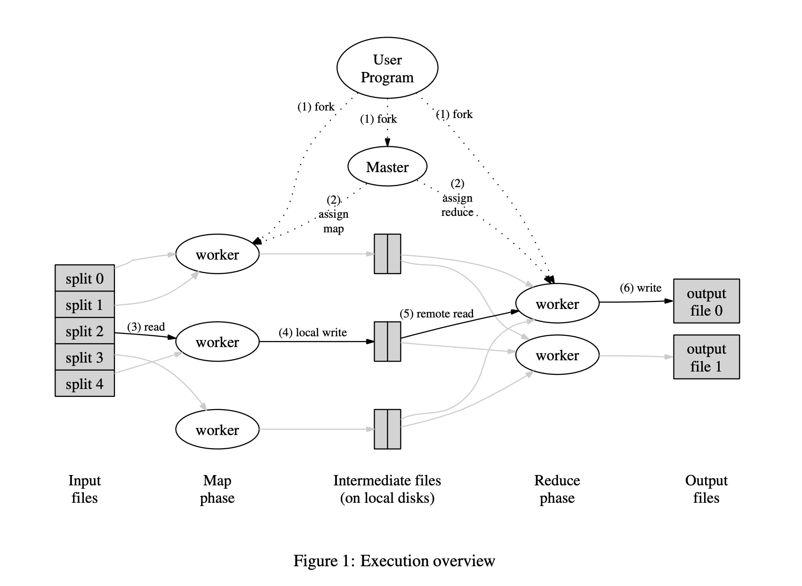

# MAPREDUCE

[paper](https://static.googleusercontent.com/media/research.google.com/zh-CN//archive/mapreduce-osdi04.pdf)

Hadoop的框架最核心的设计就是：HDFS和MapReduce。HDFS为海量的数据提供了存储，而MapReduce则为海量的数据提供了计算。

`MAPREDUCE`是一个编程模型，也是一个处理和生成超大数据集的算法模型的相关实现。用**户首先创建一个Map函数处理一个基于key/value pair的数据集合，输出中间的基于key/value pair的数据集合；然后再创建一个Reduce函数用来合并所有的具有相同中间key值的中间value值**。MapReduce架构的程序能够在大量的普通配置的计算机上实现并行化处理。这个系统在运行时只关心：如何分割输入数据，在大量计算机组成的集群上的调度，集群中计算机的错误处理，管理集群中计算机之间必要的通信。

例如计算一个大文档中每个单词出现的次数，map和reduce的伪代码如下：

```cpp
map(String key, String value):
    // key: document name
    // value: document contents
    for each word w in value:
        EmitIntermediate(w, “1″);
reduce(String key, Iterator values):
    // key: a word
    // values: a list of counts
    int result = 0;
    for each v in values:
        result += ParseInt(v);
    Emit(AsString(result));
```

map和reduce的输入输出类型如下：
```
map(k1,v1) ->list(k2,v2)
reduce(k2,list(v2)) ->list(v2)
```

可用简单的mapreduce模型计算的例子:
1. 计算URL访问频率：Map函数处理日志中web页面请求的记录，然后输出(URL,1)。Reduce函数把相同URL的value值都累加起来，产生(URL,记录总数)结果。
2. Map函数分析每个文档输出一个(词,文档号)的列表，Reduce函数的输入是一个给定词的所有（词，文档号），排序所有的文档号，输出(词,list（文档号）)。所有的输出集合形成一个简单的倒排索引，它以一种简单的算法跟踪词在文档中的位置。

执行过程：


Master持有一些数据结构，它存储每一个Map和Reduce任务的状态（空闲、工作中或完成)，以及Worker机器(非空闲任务的机器)的标识。

Master就像一个数据管道，中间文件存储区域的位置信息通过这个管道从Map传递到Reduce。因此，对于每个已经完成的Map任务，master存储了Map任务产生的R个中间文件存储区域的大小和位置。当Map任务完成时，Master接收到位置和大小的更新信息，这些信息被逐步递增的推送给那些正在工作的Reduce任务。

