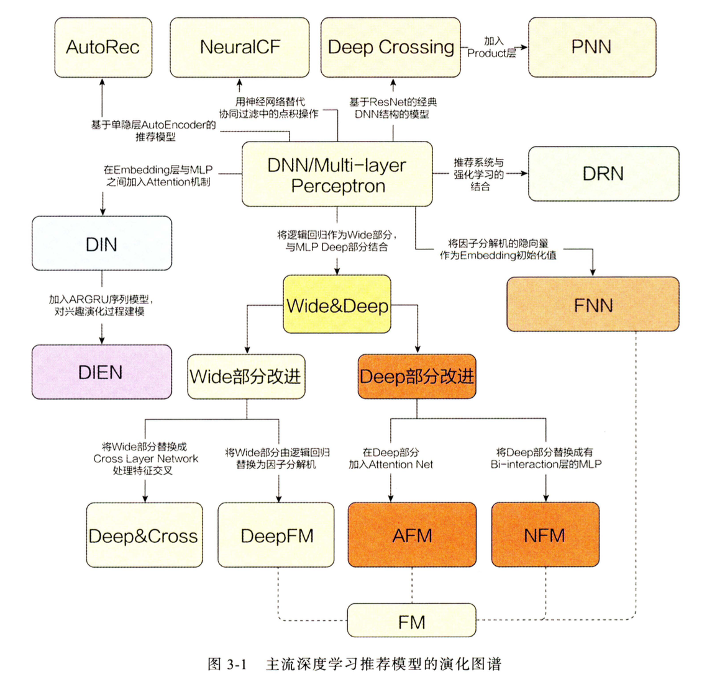

# 推荐模型

推荐模型面临的共性问题有：
* 头部问题：视频之间贫富差距大

推荐模型的发展关键点：
* 特征交叉
* 注意力

推荐算法分类：
* 根据产品的存在形式可以分为：首页推荐、热门推荐和相关推荐等。
* 根据推荐技术的不同分为：基于内容的推荐、基于协同过滤的推荐、基于混合的推荐。
* 根据利用的信息不同可分为：协同过滤推荐、社会化推荐、兴趣点推荐、知识图推荐以及标签推荐等。
* 根据推荐任务不同可分为：评分预测和项目排序。
* 根据模型所利用假设不同分为：以KNN为代表的非训练的方法，以MF为代表的传统机器学习方法，以及以Wide&Deep模型为代表的深度学习推荐等。

## 传统模型

* CF
    * UserCF
    * ItemCF
    * 可以用稀疏矩阵来表示共现矩阵
    * 相似度的计算有三种方法
        * 余弦相似度
        * 去除user评分均值的相似度
        * 去除物品评分均值的相似度【这种有错误吧！？】
* MF
    * 用`nn.Embedding`来取向量
* FM
    * dense特征取对数，sparse特征进行类别编码
    * 注意稀疏特征相乘时是两个float数字相乘，onehot之后的特征每个维度都对应一个编码向量，比如性别的男和女各对应一个编码向量；但是连续特征只对应一个编码向量
    * FFM引入filed的概念，比如性别的男和女属于一个field，连续特征的年龄属于一个field。FM中的一个编码向量，在这里扩充为filed个。
* GBDT+LR
    * 是特征工程模型化的开端
* LS-PLM，也叫MLR(MixedLogisticRegression，混合逻辑回归)
    * 首先用聚类函数 π对样本进行分类 (这里的 π 采用了 softmax 函数对样本进行多分类)，再用 LR 模型计算样本在分片中具体的 CTR，然后将二者相乘后求和。
    * $f(x)=\sum_{i=1}^{m} \pi_{i}(x) \cdot \eta_{i}(x)=\sum_{i=1}^{m} \frac{\mathrm{e}^{\mu_{i} \cdot x}}{\sum_{j=1}^{m} \mathrm{e}^{\mu_{j} \cdot x}} \cdot \frac{1}{1+\mathrm{e}^{-w_{i} \cdot x}}$
    * 其中的超参数"分片数"， m可以较好地平衡模型的拟合与推广能力 。 当 m=l 时， LS-PLM 就退化为普通的逻辑回归 。 m越大，模型的拟合能力越强 。 与此同时，模型参数规模也随 m 的增大而线性增长，模型收敛所需的训练样本也随之增长。 在实践中，阿里巴巴给出的m的经验值为12。

## 深度学习模型

* AutoRec
    * 可分为基于User和基于Item的自编码器
* DeepCrossing
    * 
    * 将所有的Embedding拼接起来，再和dense特征拼接起来
* NeuralCF
    * 
    * 
    * NeuralCF更像是从MF发展的，是FM增加了另外一路高阶，其实叫NeuralMF更好理解
* PNN
    * PNN虽然也用了DNN来对特征进行交叉组合，但是并不是直接将低阶特征放入DNN中，而是设计了Product层先对低阶特征进行充分的交叉组合之后再送入到DNN中去。
    * 是DeepCrossing的改进，特征之间不直接用拼接的方式
    * 
    * PNN模型对于深度学习结构的创新主要在于乘积层的引入。具体地说， PNN 模型的乘积层由线性操作部分(图 3-12 中乘积层的 z 部分，对各特征向量进行 线性拼接)和乘积操作部分(图 3-12 中乘积层的 p 部分)组成 。 其中，乘积特征交叉部分又分为内积操作和外积操作，使用内积操作的 PNN 模型被称为 IPNN (Inner Product-based Neural Network)，使用外积操作的 PNN模型被称为 OPNN ( Outer Product-based Neural Network )。
    * 乘积层只对稀疏特征进行交叉，每个稀疏特征都映射为`(1，embed_dim)`的向量，
    * 内积和外积的用法看代码用的好奇怪【？？？】
* Wide&Deep：记忆能力和泛化能力的综合
    * 
    * Wide 部分的输入仅仅是已安 装应用 和曝光应用两类特征，其中已安装应用 代表用户的历史行为，而曝光应用代表当前的待推荐应用。 选择这两类特征的原 因是充分发挥 Wide 部分"记忆能力"强的优势 。 
* Deep&Cross
    * 设计 Cross 网络的目的是增加特征之间的交互力度，使用多层交叉层( Cross layer)对输入向量进行特征交叉 。 
    * 
* FNN：用FM的隐向量完成Embedding层的初始化
    * 
* DeepFM：用 FM 代替 Wide 部分
    * 
* NFM：FM的神经网络化尝试
    * 
    * 
* AFM
    * 
    * 该注意力网络的结构是一个简单的单全连接层加 softmax输出层的结构， 其数学形式：
    * $a_{i j=}^{\prime} \boldsymbol{h}^{\mathrm{T}} \operatorname{Re} \mathrm{LU}\left(\boldsymbol{W}\left(\boldsymbol{v}_{i} \odot \boldsymbol{v}_{j}\right) x_{i} x_{j}+\boldsymbol{b}\right)$
    * $a_{i j}=\frac{\exp \left(a_{i j}^{\prime}\right)}{\sum_{(i, j) \in \mathcal{R}_{x}} \exp \left(a_{i j}^{\prime}\right)}$
* DIN
    * 
* DIEN：序列模型与推荐系统的结合
    * 

## Learning to Rank

排序学习是推荐、搜索、广告的核心方法。排序结果的好坏很大程度影响用户体验、广告收入等。
排序学习可以理解为机器学习中用户排序的方法，推荐一本微软亚洲研究院刘铁岩老师关于LTR的著作，Learning to Rank for Information Retrieval，书中对排序学习的各种方法做了很好的阐述和总结.

常用的排序学习分为三种类型：PointWise，PairWise和ListWise。

* PointWise
    * CTR就可以采用PointWise的方法学习，但是有时候排序的先后顺序是很重要的，而PointWise方法学习到全局的相关性，并不对先后顺序的优劣做惩罚
* PairWise
* ListWise

## 双塔

## DNN双塔