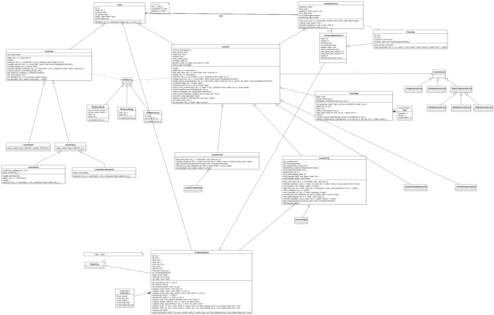

# Faiss开发

## UML类图



## Code Structure

[Faiss-code-structure](https://github.com/facebookresearch/faiss/wiki/Faiss-code-structure)

Faiss的CPU部分只在易用脚本语言包装，GPU部分是单独编写的，遵循不同的约定。

Faiss中所有的对象都是公有的，没有私有属性。

约定：类的命名采用驼峰法，方法的命名采用小写字母加下划线(这是python中的规范)。所有的类都有一个没有参数的构造函数，该构造函数将参数初始化为一些可重现的默认值。

GPU约定：GPU Faiss使用C++11编写，GPU Faiss索引对象继承自CPU版本，并提供部分(但不是完全)相同的接口。并不是CPU版本的各种功能都可以实现，但主要的接口都可以实现。现在CPU和GPU版本存在一定的不匹配，将来可能改进。

### C++代码封装

借助[SWIG](http://swig.org/exec.html)，可以在Lua和Python中调用C++代码，SWIG编译Faiss头文件，并在LUa/Python中为其找到所有的C++类。

SWIG模块`swigfaiss`在python中调用，可以在python中透明的调用函数和类方法。

### C++指针的处理

唯一棘手的部分是C ++类需要指向数组的指针时。SWIG不会自动处理这些问题。因此，Faiss SWIG包装器faiss.py添加了以下内容：

* 一个从数组中的数据中提取SWIG指针的函数：这​​是`swig_ptr(numpy.array)`。这些函数经过类型检查，并检查数组是否紧凑，但是没有针对NULL / nil / None的保护措施，也没有对数组大小的验证，因此可能会导致通常的C / C ++崩溃或内存损坏。
* 对于最常用的功能`Index::train`，`Index::add`，`Index::search`，包装写一个特定的接受直接在脚本语言的阵列，并验证它们的大小。原始函数被移到一边（例如`train-> train_c`），并被执行正确类型转换的包装函数所替代。
* 要将转换`std::vector<> v` 为numpy数组，请使用`faiss.vector_to_array(v)`，这会将数据复制到numpy（适用于标量元素的向量）。
* 要将numpy数组的内容复制到`std::vector<> v`，请使用`faiss.copy_array_to_vector(a, v)`。向量将被调整大小，仅包含的数据a。
* 要创建引用`float* x`指针的numpy数组，请使用`rev_swig_ptr(x, 125)`。numpy数组的长度为125个元素。不会复制数据，也不会检查大小。要将其与一起`std::vector<float>`使用，请使用`.data()`向量的方法来获取指向其数据的指针。

## 线程和异步调用的讨论

[Threads-and-asynchronous-calls](https://github.com/facebookresearch/faiss/wiki/Threads-and-asynchronous-calls)

## `IndexIVF`对象

[Inverted-list-objects-and-scanners](https://github.com/facebookresearch/faiss/wiki/Inverted-list-objects-and-scanners)

`IndexIVF`对象有两个组成部分
* 粗量化器，其中存储了聚类中心的向量。给定一个对象，粗量化器的搜索功能将返回该向量所属的组`(0,1,...,nlist-1)`
* `InvertedLists`对象，此对象将组id`(0,1,...,nlist-1)`映射到`(code,id)`的队列

## `InvertedLists`对象

`codes`是大小恒定为`code_size`的字符串，该对象有三个重要的方法：

```cpp
/// get the size of a list
size_t list_size(size_t list_no);

/// @return codes    size list_size * code_size
const uint8_t * get_codes (size_t list_no);
void release_codes (const uint8_t *codes) const;

/// @return ids      size list_size
const idx_t * get_ids (size_t list_no);
void release_ids (const idx_t *ids) const;
```

搜索过程的调用如下所示：

```cpp
search(v) {
    list_nos = quantizer->search(v, nprobe)
    invlists->prefetch(list_nos)
    foreach no in list_nos {
        codes = invlists->get_codes(no)
        // linear scan of codes
        // select most similar codes 
        ids = invlists->get_ids(no)
        // convert list indexes to ids
        invlists->release_ids(ids)
        invlists->release_codes(codes)
    }
}
```

### 子类`ArrayInvertedLists`

这基本上是一个`std::vector<std::vector<...> >`。它是最简单的RAM中反向列表实现，具有极少的开销和快速的添加时间。它具有特殊的状态，因为在IndexIVF构建时会自动实例化它，以便可以立即添加矢量。

### 子类`OnDiskInvertedLists`

反向列表数据存储在磁盘上的内存映射文件中。有一个间接表将列表ID映射到文件中的偏移量。由于数据是内存映射的，因此无需从磁盘上显式提取数据。但是，预取功能对于利用分布式文件系统上的并行读取很有用。

### 子类`HStackInvertedLists`和`VStackInvertedLists`

将多个反向列表组成一个，看起来像是一个反向列表

## `InvertedListScanner`对象

倒排列表扫描可以在Faiss之外进行控制。

`encode_vector`函数将反向列表转移到一个数组中，该数组可以填充非faiss管理的反向列表。

`InvertedListScanner`可以从`IndexIVF`获得对象，可以扫描列表或计算单个查询到代码的距离。

### 编码向量

要对向量进行编码，调用代码应该：
* 量化向量找到存储向量的反向列表
* 嗲用`encode_vectors`对齐进行实际编码

```cpp
// size nb
idx_t *list_nos = ... ; 
// find inverted list numbers 
index_ivf.quantizer->assign (nb, xb, list_nos);

// size index->code_size * nb
uint8_t *codes = ...; 
// compute the codes to store
index->encode_vectors (nb, xb, list_nos, codes);

// populate the custom inverted lists 
for (idx_t i = 0; i < nb; i++) {
      idx_t list_no = list_nos[i]; 
      // allocate a new entry in the inverted list list_no
      // get a pointer to the new entry's id and code
      idx_t * id_ptr = ... 
      uint8_t * code_ptr =  ...
      // assume the vectors are numbered sequentially
      *id_ptr = i; 
      memcpy (code_ptr, codes + i * index->code_size, index->code_size);
}
```

### 查找

```cpp
// size nprobe * nq
float * q_dis =  ...
idx_t *q_lists = ...
// perform quantization manually
index.quantizer->search (nq, xq, nprobe, q_dis, q_lists); 

// get a scanner object
scanner = index.get_InvertedListScanner();

// allocate result arrays (size k * nq), properly initialized
idx_t *I = ...
float *D = ...

// loop over queries
for (idx_t i = 0; i < nq; i++) {
    // set the current query
    scanner->set_query (xq + i * d);

    // loop over inverted lists for this query
    for (int j = 0; j < nprobe; j++) {
        // set the current inverted list
        int list_no = q_lists[i * nprobe + j];
        scanner->set_list (list_no, q_dis[i * nprobe + j]);

        // get the inverted list from somewhere
        long list_size = ...
        idx_t *ids = ....
        uint8_t *codes = ....
        // perform the scan, updating result lists
        scanner->scan_codes (list_size, codes, ids, D + i * k, I + i * k, k); 
   }
   // re-order heap in decreasing order
   maxheap_reorder (k, D + i * k, I + i * k);
}
```

## 不适合内存的索引

[Indexes-that-do-not-fit-in-RAM](https://github.com/facebookresearch/faiss/wiki/Indexes-that-do-not-fit-in-RAM)

可能会采用如下三种方式：
* 在多台计算机上分片存储索引
* 将索引存储在磁盘上（或者分布式文件系统）
* 将索引存储在分布式键值存储中

## 向量编码

[Vector-codecs](https://github.com/facebookresearch/faiss/wiki/Vector-codecs)

Faiss可以将向量编码为二进制blobs。独立的编解码器有三个，以`sa_(standalone)`开头
* `sa_code_size`返回编解码器生成的代码的大小（以字节为单位）
* `sa_encode`将一组向量编码为一组代码
* `sa_decode`将一组代码解码为向量
