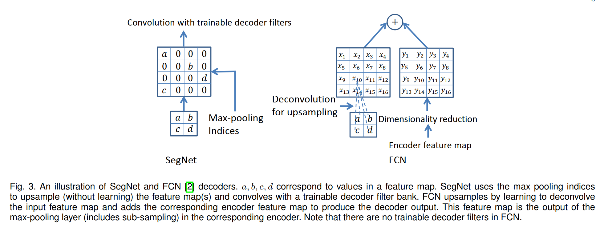

# Semantic Segmentation

| model | conference | paper | first author | institute |
| - | - | - | - | - |
| FCN | CVPR 2015 | Fully Convolutional Networks for
Semantic Segmentation | Jonathan Long/Evan Shelhamer | UC Berkeley |

## 数据集
cityscapes：共2975张图片。
https://www.cityscapes-dataset.com/

## FCN

动机和创新点：
* 将CNN用在semantic segmentation中, trained end-to-end, pixelsto-pixels。
* 用全卷积网络代替全连接，可以处理任意的不同size的输入和输出
* 将当前分类网络改编成全卷积网络（AlexNet、 VGGNet和GoogLeNet） 并进行微调，设计了跳跃连接将全局信息和局部信息连接起来， 相互补偿
* 全局信息解决是什么的问题（分类），局部信息解决在哪里的问题。

实验证明FCN-8s是最佳网络。

模型：跳层连接用的是crop and sum.

上采样：转置卷积。
> 转置卷积分为三步
  * 第一步：对输入的特征图进行差值，插入0，新的长度是 $H' = H + (stride-1)*(H-1)$，即相当于没两个像素点之间，插入(stride-1)个0
  * 第二步：新的卷积核的stride为1，kernel size不变，padding'为kernal size - padding - 1
  * 第三步：利用新的卷积核和新的特征图，得到最终的逆卷积结果
  * 综合前三步的结果，可以得到输入输出的对应关系
  * 当kernal_size=4，stride=2，padding=0时，$H_{out}=2*H_{in}+2$
  * 当kernal_size=16，stride=8，padding=0时，$H_{out}=8*H_{in}+8$

$$H_{out}=(H_{in}−1)×stride[0]−2×padding[0]+kernel_{size[0]}+output_{padding[0]}$$

损失函数用交叉熵，即pixel-wise的多分类，每个pixel都贡献损失。

在pytorch中，损失函数用`nll_loss=nn.NLLLoss2d(weight, size_average, ignore_index)`，`nll_loss(F.log_softmax(inputs), targets)`，
NLL的含义是The negative log likelihood loss. 这个损失就是对每个像素点用交叉熵。

$$
\ell(x, y)=\left\{\begin{array}{ll}
\sum_{n=1}^{N} \frac{1}{\sum_{n=1}^{N} w_{y_{n}}} l_{n}, & \text { if reduction }=\text { 'mean' } \\
\sum_{n=1}^{N} l_{n}, & \text { if reduction }=\text { 'sum' }
\end{array}\right.
$$

Softmax函数，或称归一化指数函数，公式是
$$
\sigma(\mathbf{z})_{j}=\frac{e^{z_{j}}}{\sum_{k=1}^{K} e^{z_{k}}} \quad \text { for } j=1, \ldots, K
$$
logsoftmax函数，即在softmax之后加log，即
$$
\operatorname{LogSoftmax}\left(x_{i}\right)=\log \left(\frac{\exp \left(x_{i}\right)}{\sum_{j} \exp \left(x_{j}\right)}\right)
$$


对于FCN8s这个模型，输入图片的大小设置为`(256, 512)`，第一个cnn的padding设置为100，用vgg16作为backbone，各个层的输入输出的size如下：

```
----------------------------------------------------------------
        Layer (type)               Output Shape         Param #
================================================================
            Conv2d-1         [-1, 64, 454, 710]           1,792
              ReLU-2         [-1, 64, 454, 710]               0
            Conv2d-3         [-1, 64, 454, 710]          36,928
              ReLU-4         [-1, 64, 454, 710]               0
         MaxPool2d-5         [-1, 64, 227, 355]               0
            Conv2d-6        [-1, 128, 227, 355]          73,856
              ReLU-7        [-1, 128, 227, 355]               0
            Conv2d-8        [-1, 128, 227, 355]         147,584
              ReLU-9        [-1, 128, 227, 355]               0
        MaxPool2d-10        [-1, 128, 114, 178]               0
           Conv2d-11        [-1, 256, 114, 178]         295,168
             ReLU-12        [-1, 256, 114, 178]               0
           Conv2d-13        [-1, 256, 114, 178]         590,080
             ReLU-14        [-1, 256, 114, 178]               0
           Conv2d-15        [-1, 256, 114, 178]         590,080
             ReLU-16        [-1, 256, 114, 178]               0
        MaxPool2d-17          [-1, 256, 57, 89]               0
           Conv2d-18          [-1, 512, 57, 89]       1,180,160
             ReLU-19          [-1, 512, 57, 89]               0
           Conv2d-20          [-1, 512, 57, 89]       2,359,808
             ReLU-21          [-1, 512, 57, 89]               0
           Conv2d-22          [-1, 512, 57, 89]       2,359,808
             ReLU-23          [-1, 512, 57, 89]               0
        MaxPool2d-24          [-1, 512, 29, 45]               0
           Conv2d-25          [-1, 512, 29, 45]       2,359,808
             ReLU-26          [-1, 512, 29, 45]               0
           Conv2d-27          [-1, 512, 29, 45]       2,359,808
             ReLU-28          [-1, 512, 29, 45]               0
           Conv2d-29          [-1, 512, 29, 45]       2,359,808
             ReLU-30          [-1, 512, 29, 45]               0
        MaxPool2d-31          [-1, 512, 15, 23]               0
           Conv2d-32          [-1, 4096, 9, 17]     102,764,544
             ReLU-33          [-1, 4096, 9, 17]               0
          Dropout-34          [-1, 4096, 9, 17]               0
           Conv2d-35          [-1, 4096, 9, 17]      16,781,312
             ReLU-36          [-1, 4096, 9, 17]               0
          Dropout-37          [-1, 4096, 9, 17]               0
           Conv2d-38            [-1, 19, 9, 17]          77,843
  ConvTranspose2d-39           [-1, 19, 20, 36]           5,776
           Conv2d-40           [-1, 19, 29, 45]           9,747
  ConvTranspose2d-41           [-1, 19, 42, 74]           5,776
           Conv2d-42           [-1, 19, 57, 89]           4,883
  ConvTranspose2d-43         [-1, 19, 344, 600]          92,416
================================================================
Total params: 134,456,985
Trainable params: 134,456,985
Non-trainable params: 0
----------------------------------------------------------------
Input size (MB): 1.50
Forward/backward pass size (MB): 1467.26
Params size (MB): 512.91
Estimated Total Size (MB): 1981.68
----------------------------------------------------------------
```

评测指标：

1. 首先计算混淆矩阵，这个方法十分巧妙，得出`(n_class, n_class)`的一个矩阵，即为混淆矩阵
2. 评测指标有：acc、acc_cls、iu、mean_iu、fwavacc

```python
def _fast_hist(label_true, label_pred, n_class):
    mask = (label_true >= 0) & (label_true < n_class)
    hist = np.bincount(
        n_class * label_true[mask].astype(int) +
        label_pred[mask], minlength=n_class ** 2).reshape(n_class, n_class)
    return hist

# 上述方法可以用以下代码验证：
num_classes = 3
gts = np.random.randint(0,num_classes,(4,8,8))
preds = np.random.randint(0,num_classes,(4,8,8))
hist = np.bincount((num_classes*gts.astype(int) + preds).flatten(),minlength=num_classes ** 2).reshape(num_classes, num_classes)

# 计算方法如下
# axis 0: gt, axis 1: prediction
acc = np.diag(hist).sum() / hist.sum()
acc_cls = np.diag(hist) / hist.sum(axis=1)
acc_cls = np.nanmean(acc_cls)
iu = np.diag(hist) / (hist.sum(axis=1) + hist.sum(axis=0) - np.diag(hist))
mean_iu = np.nanmean(iu)
freq = hist.sum(axis=1) / hist.sum()
fwavacc = (freq[freq > 0] * iu[freq > 0]).sum()
```

## U-Net

模型：增加了很多跨层连接，用的是crop and concat.

上采样：转置卷积。

损失：和FCN一样，给不同pixel加了不同的权重（权重和该像素点离最近的细胞的距离有关，将注意力放在两个细胞的分界位置）。


## FusionNet

模型：基本和U-Net一致，但是跨层连接的分辨率保持不变，用的是 sum。
上采样：转置卷积。


## DeconvNet

上采样：反卷积+反池化


## SegNet

FCN弊端：忽略了高分辨率的特征图，导致边缘信息的丢失（最好的模型是8s的，没有结合的高分辨率信息）；FCN编码器中有大量参数，但解码器非常的小。

上采样：和fcn不同，利用了pooling中的index信息，不再index的位置补0，之后增加的卷积层也起到了将这些0填充的作用，和转置卷积的差别不是很大，torch.nn有利用upmaxpool函数。如下图所示：

)

提出完全对称的编码器解码器结构


