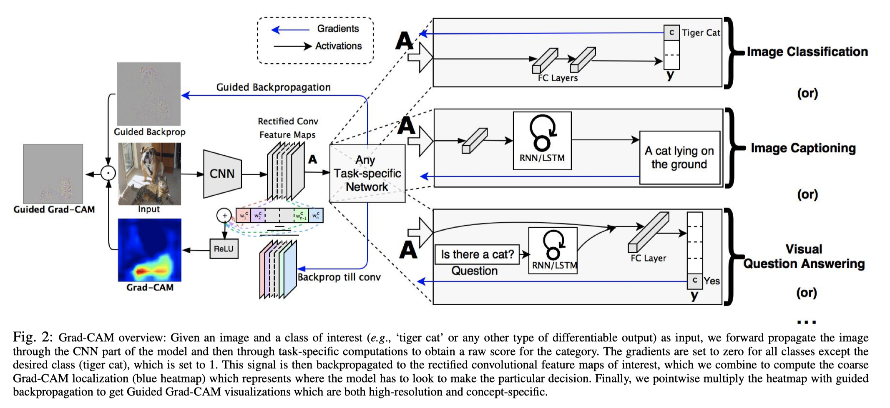
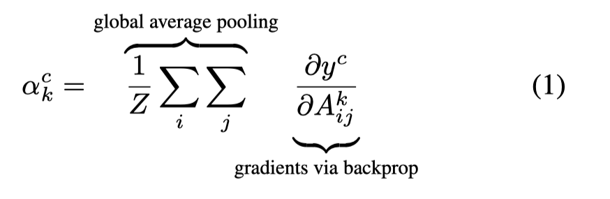
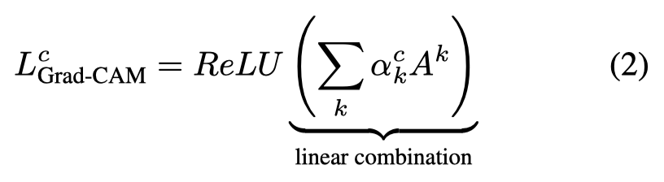
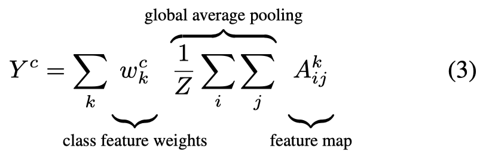

# Visualization

可视化仓库: [utkuozbulak/pytorch-cnn-visualizations](https://github.com/utkuozbulak/pytorch-cnn-visualizations)

| conference | paper | first author | institute |
| - | - | - | - | - |
| ECCV 2014 | Visualizing and Understanding Convolutional Networks | Matthew D. Zeiler | Dept. of Computer Science, Courant Institute, New York University |
| ICCV 2017 | Grad-CAM: Visual Explanations from Deep Networks via Gradient-based Localization | Ramprasaath R. Selvaraju | Georgia Institute of Technology, Atlanta, GA, USA |

## Grad-CAM







## Vanilla Backpropagation

1. 将图片转化为可以求梯度的tensor
2. 将图片输入网络
3. 反传梯度时将目标类的one hot设为1，其他为0
4. 将梯度进行0-1的min-max归一化，然后保存为彩色图片
5. 对三个通道的梯度绝对值相加，然后进行0-1的min-max归一化，然后保存为灰度图片

## Guided Backpropagation

在`Vanilla Backpropagation`的基础之上，对ReLU激活层的反向传播进行修正。

1. 将反传的负的梯度设为0

这里除了彩色图和灰度图之外，也对正的和负的梯度分别展示（和彩色图的展示方法一样）。

代码如下：

```python
    def update_relus(self):
        """
            Updates relu activation functions so that
                1- stores output in forward pass
                2- imputes zero for gradient values that are less than zero
        """
        def relu_backward_hook_function(module, grad_in, grad_out):
            """
            If there is a negative gradient, change it to zero
            """
            # Get last forward output
            corresponding_forward_output = self.forward_relu_outputs[-1]
            corresponding_forward_output[corresponding_forward_output > 0] = 1
            modified_grad_out = corresponding_forward_output * torch.clamp(grad_in[0], min=0.0)
            del self.forward_relu_outputs[-1]  # Remove last forward output
            return (modified_grad_out,)

        def relu_forward_hook_function(module, ten_in, ten_out):
            """
            Store results of forward pass
            """
            self.forward_relu_outputs.append(ten_out)

        # Loop through layers, hook up ReLUs
        for pos, module in self.model.features._modules.items():
            if isinstance(module, ReLU):
                module.register_backward_hook(relu_backward_hook_function)
                module.register_forward_hook(relu_forward_hook_function)
```

## Gradient-weighted Class Activation Map (Grad-CAM)


## Score-weighted Class Activation Map (Score-CAM)

## Guided Gradient-weighted Class Activation Map (Guided-Grad-CAM)
