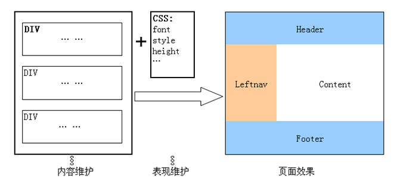
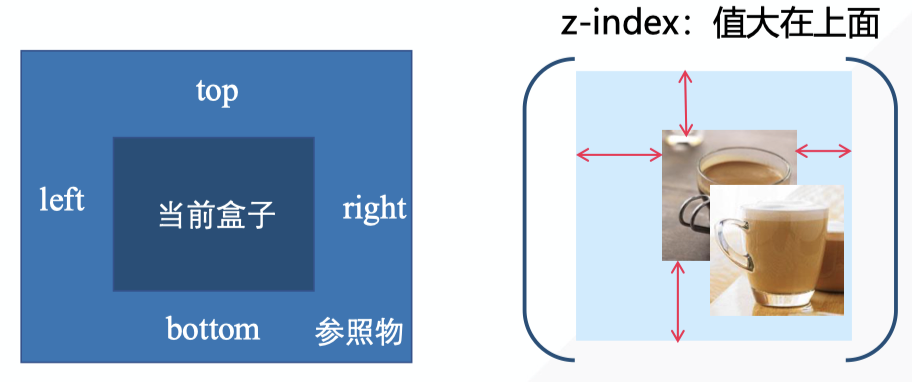

# CSS基础语法

> 感谢：w3school的[css教程](https://www.w3school.com.cn/css/index.asp)
> 感谢：北京林业大学孙俏老师开设在中国大学MOOC上的[Web前端开发课程](https://www.icourse163.org/course/BFU-1003382003)

# 基础语法

## 基本概念：选择器、属性、值

CSS 规则由两个主要的部分构成：选择器，以及一条或多条声明。

`selector {declaration1; declaration2; ... declarationN }`

每条声明由一个属性和一个值组成。属性（property）是您希望设置的样式属性（style attribute）。每个属性有一个值。属性和值被冒号分开。

**不要在属性值与单位之间留有空格。**

`selector {property: value}`

eg:`h1 {color:red; font-size:14px;}`

* 颜色的不同写法：
  * 英文单词 red
  * 十六进制的颜色值 `#ff0000`，或者 CSS 的缩写形式：`#f00`
  * rgb方式：`rgb(255,0,0)`或者`rgb(100%,0%,0%)`

* 如果值为若干单词，需要加引号：
  * `p {font-family: "sans serif";}`

## 空格与大小写

* 包含空格不影响css的工作效果
* css对大小写不敏感
* 但是，与html一块工作时，class和id名称对大小写敏感

## 多重样式表层叠为一个：优先级

样式表允许以多种方式规定样式信息。样式可以规定在单个的 HTML 元素中，在 HTML 页的头元素中，或在一个外部的 CSS 文件中。甚至可以在同一个 HTML 文档内部引用多个外部样式表。

一般而言，所有的样式会根据下面的规则层叠于一个新的虚拟样式表中，其中数字 4 拥有最高的优先权。

1. 浏览器缺省设置
2. 外部样式表
3. 内部样式表（位于 <head> 标签内部）
4. 内联样式（在 HTML 元素内部）

# 高级语法

## 选择器的分组

用逗号将需要分组的选择器分开，可以同时对多个选择器进行配置。

`h1,h2,h3,h4,h5,h6 {color: green;}`

## 样式的继承问题

css中子元素从父元素继承属性，比如设置：

`body {font-family: Verdana, sans-serif;}`

根据上面这条规则，站点的 body 元素将使用 Verdana 字体（假如访问者的系统中存在该字体的话）。**不需要另外的规则，所有 body 的子元素都应该显示 Verdana 字体，子元素的子元素也一样。**

如果你不希望 "Verdana, sans-serif" 字体被所有的子元素继承，又该怎么做呢？比方说，你希望段落的字体是 Times。
创建一个针对 p 的特殊规则，这样它就会摆脱父元素的规则：
`p  {font-family: Times, "Times New Roman", serif;}`

# 派生选择器

派生选择器允许你根据文档的上下文关系来确定某个标签的样式。通过合理地使用派生选择器，我们可以使 HTML 代码变得更加整洁。

比方说，你希望列表中的 strong 元素变为斜体字，而不是通常的粗体字，可以这样定义一个派生选择器：

```css
li strong {
    font-style: italic;
    font-weight: normal;
  }
```

# id选择器

id 选择器可以为标有特定 id 的 HTML 元素指定特定的样式。id 选择器以 "#" 来定义。

两个 id 选择器，第一个可以定义元素的颜色为红色，第二个定义元素的颜色为绿色：

```css
#red {color:red;}
#green {color:green;}
```

```html
<p id="red">这个段落是红色。</p>
<p id="green">这个段落是绿色。</p>
```

## id选择器和派生选择器

在现代布局中，id 选择器常常用于建立派生选择器。

```css
#sidebar p {
    font-style: italic;
    text-align: right;
    margin-top: 0.5em;
    }
```

上面的样式只会应用于出现在 id 是 sidebar 的元素内的段落。这个元素很可能是 div 或者是表格单元，尽管它也可能是一个表格或者其他块级元素。

# 类选择器

在 CSS 中，类选择器以一个点号显示：
`.center {text-align: center}`

在上面的例子中，所有拥有 center 类的 HTML 元素均为居中。

在下面的 HTML 代码中，h1 和 p 元素都有 center 类。这意味着两者都将遵守 ".center" 选择器中的规则。

```html
<h1 class="center">
This heading will be center-aligned
</h1>

<p class="center">
This paragraph will also be center-aligned.
</p>
```

多个class选择器可以混用，用空格分开。

`<div class="one yellow left">……</div>`

id和class也可以混用

`<div id="my" class="one yellow left" >`

id选择器不可以多个同时使用

## 类用作派生选择器

类名为fancy的元素内部（可能是一个表格或者div）的表格单元会以灰色背景显示橙色文字。

```css
.fancy td {
    color: #f60;
    background: #666;
    }
```

元素也可以基于他们的类而被选择：

```css
td.fancy {
    color: #f60;
    background: #666;
    }
```

在上面的例子中，类名为 fancy 的表格单元将是带有灰色背景的橙色。`<td class="fancy">`
另外，class 为 fancy 的段落也不会是带有灰色背景的橙色，当然，任何其他被标注为 fancy 的元素也不会受这条规则的影响。

# 属性选择器

对带有指定属性的 HTML 元素设置样式。
可以为拥有指定属性的 HTML 元素设置样式，而不仅限于 class 和 id 属性。

下面的例子为带有 title 属性的所有元素设置样式：
`[title]{color:red;}`

下面的例子为 title="W3School" 的所有元素设置样式：
`[title=W3School]{border:5px solid blue;}`

下面的例子为包含指定值的 title 属性的所有元素设置样式。适用于由空格分隔的属性值：
`[title~=hello] { color:red; }`
符号`~=`指的是题目中包含hello词汇的元素。

下面的例子为带有包含指定值的 lang 属性的所有元素设置样式。适用于由连字符分隔的属性值：
`[lang|=en] { color:red; }`

# 如何插入样式表

## 外部样式表

当样式需要应用于很多页面时，外部样式表将是理想的选择。在使用外部样式表的情况下，你可以通过改变一个文件来改变整个站点的外观。每个页面使用 <link> 标签链接到样式表。<link> 标签在（文档的）头部：

```html
<head>
<link rel="stylesheet" type="text/css" href="mystyle.css" />
</head>
```

浏览器会从文件 mystyle.css 中读到样式声明，并根据它来格式文档。

## 内部样式表

当单个文档需要特殊的样式时，就应该使用内部样式表。你可以使用 `<style>` 标签在文档头部定义内部样式表，就像这样:

```css
<head>
<style type="text/css">
  hr {color: sienna;}
  p {margin-left: 20px;}
  body {background-image: url("images/back40.gif");}
</style>
</head>
```

## 内联样式

由于要将表现和内容混杂在一起，内联样式会损失掉样式表的许多优势。请慎用这种方法，例如当样式仅需要在一个元素上应用一次时。

要使用内联样式，你需要在相关的标签内使用样式（style）属性。Style 属性可以包含任何 CSS 属性。本例展示如何改变段落的颜色和左外边距：

```html
<p style="color: sienna; margin-left: 20px">
This is a paragraph
</p>
```

# css样式

主要包括背景、文本、字体、连接、列表、表格、轮廓。

# css框模型

CSS 框模型 (Box Model) 规定了元素框处理元素内容、内边距、边框 和 外边距 的方式。


提示：**背景应用于由内容和内边距、边框组成的区域。**

```css
#box {
  width:100px;
  height:100px;
  border:1px solid;
  padding:20px;
  margin:10px;
  overflow:auto;
}
```

其中，元素的取值：px，%（外层盒子的宽度和高度），
如果有四个属性，顺序是**上右下左**

* overflow属性：
  * hidden 超出部分不可见
  * scroll 显示滚动条
  * auto 如果有超出部分，显示滚动条
* border属性
  * border-width 
  * border-stype
  * border-color
  * border: width style color
* margin属性
  * `margin:1px;`等价于`margin:1px 1px 1px 1px;`
  * `margin:1px 2px;`等价于`margin:1px 2px 1px 2px;`
  * `margin:1px 2px 3px;`等价于`margin:1px 2px 3px 2px;`
  * margin的合并：垂直方向合并，水平方向不合并

# css定位Positioning

CSS 定位 (Positioning) 属性允许你对元素进行定位。

CSS 为定位和浮动提供了一些属性，利用这些属性，可以建立列式布局，将布局的一部分与另一部分重叠，还可以完成多年来通常需要使用多个表格才能完成的任务。

定位的基本思想很简单，它允许你定义元素框相对于其正常位置应该出现的位置，或者相对于父元素、另一个元素甚至浏览器窗口本身的位置。显然，这个功能非常强大。

**一切皆为框**

div、h1 或 p 元素常常被称为块级元素。这意味着这些元素显示为一块内容，即“块框”。与之相反，span 和 strong 等元素称为“行内元素”，这是因为它们的内容显示在行中，即“行内框”。

## css定位机制

CSS 有三种基本的定位机制：文档流flow、浮动float和层定位layer。默认所有框都在文档流中定位。

## web标准css布局：盒子模型

用代码块`<div>`对页面进行布局，每个代码块采用不同的css文件来控制样式。

> [什么是div+css](http://www.adminwang.com/css/81.html)

采用CSS布局相对于传统的TABLE网页布局而具有以下3个显著优势：

**1：表现和内容相分离**

将设计部分剥离出来放在一个独立样式文件中，HTML文件中只存放文本信息。这样的页面对搜索引擎更加友好。

**2：提高页面浏览速度**

对于同一个页面视觉效果，采用CSS布局的页面容量要比TABLE编码的页面文件容量小得多，前者一般只有后者的1/2大小。浏览器就不用去编译大量冗长的标签。

**3：易于维护和改版**

你只要简单的修改几个CSS文件就可以重新设计整个网站的页面。



html+css做到了内容与样式分离，代码可读性强，可复用性高。

## 文档流flow

从上到下，从左到右依次排列。

有些元素会单独占一行，有些元素会和其他元素共占一行，分为三种：block、inline、inline-block。可以通过元素的display属性改变该属性。

`block`
* 独占一行
* 元素的height、width、margin、padding都可设置

常见的block元素有
`<div>、<p>、<h1>...<h6>、 <ol>、<ul>、<table>、<form>`

显示为block元素`display:block;`

`inline`
* 不单独占用一行
* width、height不可设置
* width就是它包含的文字或图片的宽度，不可改变

常见的inline元素
`<span>、<a>`

显示为inline元素`display:inline;`

注意：inline有一个间距问题，可以用block元素在外面包一层

`inline-block`
* 就是同时具备inline元素、block元素的特点
* 不单独占用一行
* 元素的height、width、margin、padding都可设置

常见的inline元素
``

显示为inline元素`display:inline-block;`

块级框从上到下一个接一个地排列，框之间的垂直距离是由框的垂直外边距计算出来。

行内框在一行中水平布置。可以使用水平内边距、边框和外边距调整它们的间距。但是，垂直内边距、边框和外边距不影响行内框的高度。由一行形成的水平框称为行框（Line Box），行框的高度总是足以容纳它包含的所有行内框。不过，设置行高可以增加这个框的高度。

## 浮动定位flot

浮动的框可以向左或向右移动，直到它的外边缘碰到包含框或另一个浮动框的边框为止。

float属性有`left、right、none`

clear属性有`left、right、both`
* both，清除左右两边的浮动。 
* left 和 right 只能清除一个方向的浮动。 
* none 是默认值，只在需要移除已指定的清除值时用到。

## 层定位layer

希望网页中的元素出现重叠或者叠加的效果时用层定位。像图像软件中的图层一样可以对每个layer能够精确定位操作

层定位设计五个属性`top, bottom, left, right,z-index`，`z-index`属性决定了层的前后顺序，值大的在上面，999表示顶层



`postion`属性决定了相对于谁定位
* static 默认值，没有定位，元素出现在正常的流中
  * `top, bottom, left, right,z-index`无效
* fixed 固定定位，相对于浏览器窗口进行定位
  * `top, bottom, left, right,z-index`有效
  * 不会随浏览器窗口的滚动条滚动而变化，总在视线里的元素，比如页面的广告栏
  * 坐标原点始终在浏览器窗口的左上角
* relative 相对定位，相对于其直接父元素进行定位
  * `top, bottom, left, right,z-index`有效
  * 定位为relative的元素脱离正常的文档流中，但其在文档流中的原位置依然存在
  * relative定位的层总是相对于其直接父元素，无论其父元素 是什么定位方式。
* absolute 绝对定位，相对于 static 定位以外的第一个父元素 进行定位
  * `top, bottom, left, right,z-index`有效
  * 定位为absolute的层脱离正常文本流，但与relative的区别:其在正常流中的原位置不再存在
  * 对于absolute定位的层总是相对于其 最近的定义为absolute或relative的父层，而这个父层并不 一定是其直接父层。
  * 对于absolute定位的层,如果其父层中都未定义absolute或relative，则其将相对body进行定位

例：用`relative+absolute`实现图片上层叠文字


